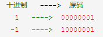
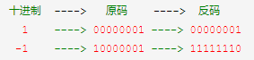
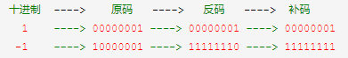
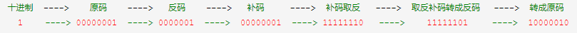
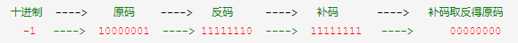
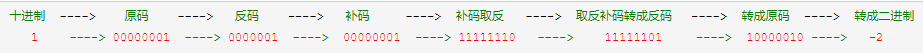
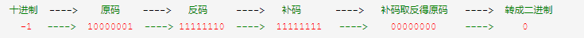

# 位运算

## 异或
异或运算有以下三个性质：

1. 任何数和 0 做异或运算，结果仍然是原来的数，即 `a ⊕ 0 = a`。
2. 任何数和其自身做异或运算，结果是 0，即 a ⊕ a = 0。
3. 异或运算满足交换律和结合律，即 a ⊕ b ⊕ a = b ⊕ a ⊕ a = b ⊕ (a ⊕ a) = b ⊕ 0 = b。

## 按位取反

### 1. 十进制转成原码
转成二进制原码，最高位是符号位，0为正数，1为负数



### 2. 原码转成反码
正数的反码就是原码，负数的反码是符号位不变，其余位取反



### 3. 反码转成补码
正数的补码还是原码，负数的补码是在反码的基础上加1



### 4. 补码取反得原码
正整数补码取反之后符号位置为1，是一个负整数，所以再按照负整数计算补码的方式逆运算得到原码
逆运算得到原码，首先将取反的补码转成反码，公式：反码 = 补码 - 1，然后将反码转成原码，符号位不变，其他位取反



负整数补码取反之后符号位置为0，是一个正整数，因正整数的反码与补码就是本身，所以不需要再进行逆运算



### 5. 将原码转成二进制



## 2的整数次幂
如果正整数y是2的整数次幂，则y的二进制表示中只有最高位是1，其余都是0，因此`y&(y-1)=0`。

## 枚举子集
将单词转化成二进制表示的数
```js
// 枚举子集方法一
for (let choose = 0; choose < (1 << word.length); ++choose) {
    let mask = 0;
    for (let i = 0; i < word.length; ++i) {
        if (choose & (1 << i)) {
            // 转为26位二进制表示的哈希值 
            mask |= (1 << (word[i].charCodeAt() - 'a'.charCodeAt()));
        }
    }
}

// 枚举子集方法二
let mask = 0;
for (let i = 0; i < word.length; ++i) {
    mask |= (1 << (word[i].charCodeAt() - 'a'.charCodeAt()));
}
let subset = mask;
while (subset) {
    subset = (subset - 1) & mask;
}
```
