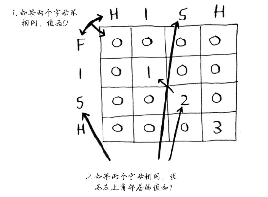
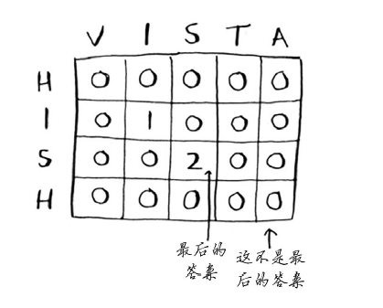
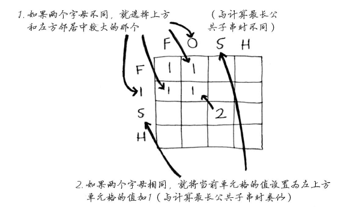

# 字符串子串问题
最长公共子串（Longest Common Substring）与最长公共子序列（Longest Common Subsequence）的区别： 
子串要求在原字符串中是连续的，而子序列则只需保持相对顺序一致，并不要求连续。
例如X = {a, Q, 1, 1}; Y = {a, 1, 1, d, f}那么，{a, 1, 1}是X和Y的最长公共子序列，但不是它们的最长公共字串。

## 最长公共子串
使用下面的公式来计算每个单元格的值：


实现这个公式的伪代码如下：
```js
if (word_a[i] == word_b[j]) { //两个字母相同
  cell[i][j] = cell[i-1][j-1] + 1;
} else { //两个字母不同
  cell[i][j] = 0;
}
```

查找单词hish和vista的最长公共子串时，网格如下：


**代码实现**
```js
function lcs(word1, word2) {
		var max = 0, index = 0;
		var lcsarr = new Array(word1.length + 1);
		for (var i = 0; i <= word1.length; ++i) {
			lcsarr[i] = new Array(word2.length + 1);
			for (var j = 0; j <= word2.length; ++j) {
				lcsarr[i][j] = 0;
			}
		}

		for (var i = 0; i <= word1.length; ++i) {
			for (var j = 0; j <= word2.length; ++j) {
				if (i == 0 || j == 0) {
					lcsarr[i][j] = 0;
				} else {
					if (word1[i-1] == word2[j-1]) {
						lcsarr[i][j] = lcsarr[i-1][j-1] + 1;
					} else {
						lcsarr[i][j] = 0;
					}
				}
				if (max < lcsarr[i][j]) {
					max = lcsarr[i][j];
					index = i;
				}
			}
		}

		var str = '';
		if (max == 0) {
			return '';
		} else {
			for (var i = index - max; i < index; ++i) {
				str += word2[i];
			}
			return str;
		}
	}
```

## 最长公共子序列
假如Alex不小心输入了fosh，他原本想输入的是fish还是fort呢？它们的最长公共子串的长度相同，都包含两个字母，
但fosh和fish更像！


求最长公共子序列使用下面的公式：


实现这个公式的伪代码如下：
```js
if (word_a[i] == word_b[j]) { //两个字母相同
  cell[i][j] = cell[i-1][j-1] + 1;
} else { //两个字母不同
  cell[i][j] = Math.max(cell[i-1][j], cell[i][j-1]);
}
```

### 1312. 让字符串成为回文串的最少插入次数
`困难`给你一个字符串 s ，每一次操作你都可以在字符串的任意位置插入任意字符。
请你返回让 s 成为回文串的最少操作次数[详细](https://leetcode-cn.com/problems/minimum-insertion-steps-to-make-a-string-palindrome/)。
```js
/**
 * @param {string} s
 * @return {number}
 */
var minInsertions = function(s) {
    const n = s.length;
    const t = s.split('').reverse();
    const dp = new Array(n+1).fill(0).map(() => new Array(n+1).fill(0));
    for (let i = 1; i < n+1; i++) {
        for (let j = 1; j < n+1; j++) {
            if (s[i-1] == t[j-1]) {
                dp[i][j] = dp[i-1][j-1] + 1;
            } else {
                dp[i][j] = Math.max(dp[i-1][j], dp[i][j-1]);
            }
        }
    } 
    return n - dp[n][n];
};
```
## 其他子串

### 187. 重复的DNA序列
`中等`所有 DNA 都由一系列缩写为 'A'，'C'，'G' 和 'T' 的核苷酸组成，例如："ACGAATTCCG"。在研究 DNA 时，识别 DNA 中的重复序列有时会对研究非常有帮助。

编写一个函数来找出所有目标子串，目标子串的长度为 10，且在 DNA 字符串 s 中出现次数超过一次。
[详细](https://leetcode-cn.com/problems/repeated-dna-sequences/)

```java
class Solution {
    static final int L = 10;
    Map<Character, Integer> bin = new HashMap<Character, Integer>() {{
        put('A', 0);
        put('C', 1);
        put('G', 2);
        put('T', 3);
    }};

    public List<String> findRepeatedDnaSequences(String s) {
        List<String> ans = new ArrayList<String>();
        int n = s.length();
        if (n <= L) {
            return ans;
        }
        int x = 0;
        for (int i = 0; i < L - 1;++i) {
            x = (x << 2) | bin.get(s.charAt(i));
        }
        Map<Integer, Integer> cnt = new HashMap<Integer, Integer>();
        for (int i = 0; i <= n - L; ++i) {
            x = ((x << 2) | bin.get(s.charAt(i + L -1))) & ((1 << (L * 2)) - 1);
            cnt.put(x, cnt.getOrDefault(x, 0) + 1);
            if (cnt.get(x) == 2) {
                ans.add(s.substring(i, i + L));
            }
        }
        return ans;
    }
}
```

