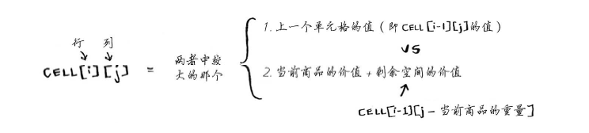

# 动态规划
动态规划解决方案从底部开始解决问题，将所有小问题解决掉，然后合并成一个整体解决方案，
从而解决一个大问题。

## 背包问题

```js
function dKnapsack(capacity, size, value, n) {
		const K = new Array(n+1).fill(0).map(() => new Array(capacity+1).fill(0));

		for (let  i = 1; i <= n; i++) {
			for (let w = 1; w <= capacity; w++) {
				if (size[i-1] <= w) {
					K[i][w] = Math.max(value[i-1] + K[i-1][w-size[i-1]], K[i-1][w]);
				} else {
					K[i][w] = K[i-1][w];
				}
			}
		}
		return K[n][capacity];
	}
```

## 53. 最大子序和
给定一个整数数组 nums ，找到一个具有最大和的连续子数组（子数组最少包含一个元素），返回其最大和。
[详细](https://leetcode-cn.com/problems/maximum-subarray/)
```js
/**
 * @param {number[]} nums
 * @return {number}
 */
var maxSubArray = function(nums) {
    let pre = 0, max = nums[0];
    nums.forEach(x => {
        pre = Math.max(pre + x, x);
        max = Math.max(max, pre);
    });
    return max;
};
```

## 338. 比特位计数
`中等`给定一个非负整数 num。对于 0 ≤ i ≤ num 范围中的每个数字 i ，计算其二进制数中的 1 的数目并将它们作为数组返回。
[详细](https://leetcode-cn.com/problems/counting-bits/)

```js
/**
 * @param {number} num
 * @return {number[]}
 */
var countBits = function(num) {
    const ans = new Array(num + 1).fill(0);
    let highBit = 0;
    for (let i = 1; i <= num; i++) {
        if ((i & (i - 1)) == 0) {
            highBit = i;
        }
        ans[i] = ans[i - highBit] + 1;
    }
    return ans;
};
```