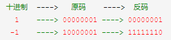
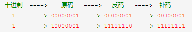
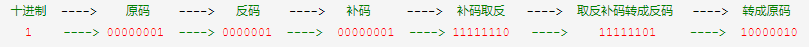
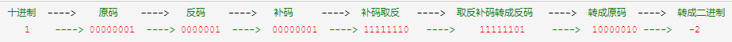
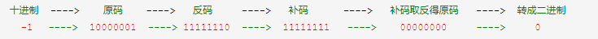

# 按位取反运算

## 1. 十进制转成原码
转成二进制原码，最高位是符号位，0为正数，1为负数

## 2. 原码转成反码
正数的反码就是原码，负数的反码是符号位不变，其余位取反

## 3. 反码转成补码
正数的补码还是原码，负数的补码是在反码的基础上加1

## 4. 补码取反得原码
正整数补码取反之后符号位置为1，是一个负整数，所以再按照负整数计算补码的方式逆运算得到原码
逆运算得到原码，首先将取反的补码转成反码，公式：反码 = 补码 - 1，然后将反码转成原码，符号位不变，其他位取反

负整数补码取反之后符号位置为0，是一个正整数，因正整数的反码与补码就是本身，所以不需要再进行逆运算

## 5. 将原码转成二进制

