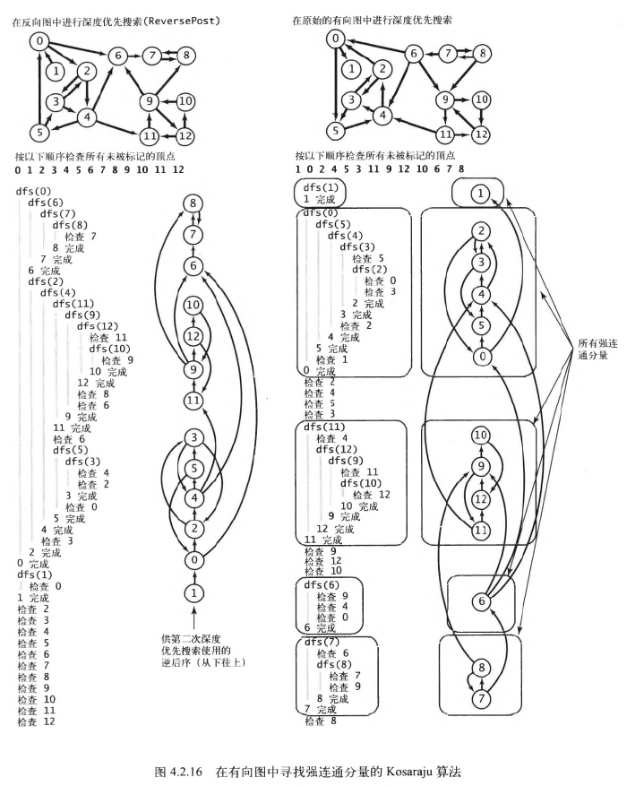

# 有向图的强连通分量
> **定义** 如果两个顶点v和w是互相可达的，则称它们为强连通的。也就是说，既存在一条从v
> 到w的有向路径，也存在一条从w到v的路径。如果一幅有向图中的任意两个顶点都是强连通的，则称这幅有向图也是强连通的。

## Kosaraju算法
使用深度优先搜索查找给定有向图G的反向图Gr，根据由此得到的所有顶点的逆后序再次用深度优先搜索处理有向图G，
其构建函数中的每一次递归调用所标记的顶点都在同一个强连通分量之中。



### 代码实现
```java
public class KosarajuSCC {
  private boolean[] marked;  // 已访问过的顶点
  private int[] id;          // 强连通分量的标识符
  private int count;         // 强连通分量的数量

  public KosarajuSCC(Digraph G) {
    marked = new boolean[G.V()];
    id = new int[G.V()];
    DepthFirstOrder order = new DepthFirstOrder(G.reverse());
    for (int s : order.reversePost()) {
      if (!marked[s]) {
        dfs(G, s);
        count++;
      }
    }
  }

  private void dfs(Digraph G, int v) {
    marked[v] = true;
    id[v] = count;
    for (int w : G.adj(v)) {
      if (!marked[w]) dfs(G, w);
    }
  }

  public boolean stronglyConnected(int v, int w) {
    return id[v] == id[w];
  }
  public int id(int v) {
    return id[v];
  }
  public int count() {
    return count;
  }
}
```