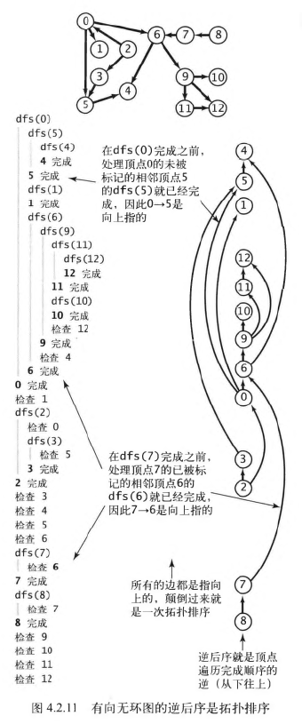
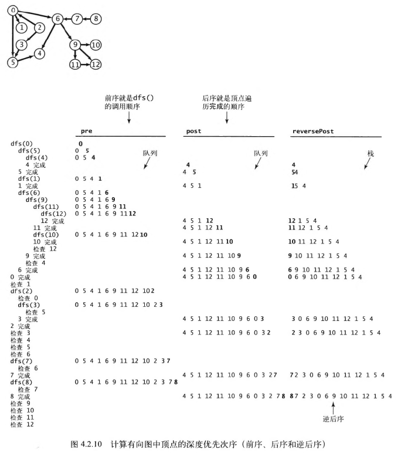

# 拓扑排序

## 定义
给定一幅有向图，将所有的顶点排序，使得所有的有向边均从排在前面的元素指向排在后面的元素
（或者说明无法做到这一点）



## 有向无环图（DAG）
> 有向无环图（DAG）就是一幅不含有环的有向图。

### 寻找有向环
```java
public class DirectedCycle {
  private boolean[] marked;
  private int[] edgeTo;
  private Stack<Integer> cycle; // 有向环中的所有顶点（如果存在）
  private boolean[] onStack;    // 递归调用栈上的所有顶点

  public DirectedCycle(Digraph G) {
    onStack = new boolean[G.V()];
    edgeTo = new int[G.V()];
    marked = new boolean[G.V()];
    for (int v = 0; v < G.V(); v++)
      if (!marked[v]) dfs(G, v);
  }
  private void dfs(Digraph G, int, v) {
    onStack[v] = true;
    marked[v] = true;
    for (int w : G.adj(v)) {
      if (this.hasCycle()) return;
      else if (!marked[w]) {
        edgeTo[w] = v;
        dfs(G, w);
      } else if (onStack(w)) {
        cycle = new Stack<Integer>();
        for (int x = v; x != w; x = edgeTo[x]) 
          cycle.push(x);
        cycle.push(w);
        cycle.push(v);  
      }
    }
    onStack[v] = false;
  }

  public boolean hasCycle() {
    return cycle != null;
  }
  
  public Iterable<Integer> cycle() {
    return cycle;
  }
}
```

## 顶点的深度优先次序
* 前序：在递归调用之前将顶点加入队列
* 后序：在递归调用之后将顶点加入队列
* 逆后序：在递归调用之后将顶点压入栈


### 代码实现
```java
public class DepthFirstOrder {
  private boolean[] marked;
  private Queue<Integer> pre;         // 所有顶点的前序排列
  private Queue<Integer> post;        // 所有顶点的后序排列
  private Stack<Integer> reversePost; // 所有顶点的逆后序排列

  public DepthFirstOrder(Digraph G) {
    pre = new Queue<Integer>();
    post = new Queue<Integer>();
    reversePost = new Stack<Integer>();
    marked = new boolean[G.V()];
    for (int v = 0; v < G.V(); v++)
      if (!marked[v]) dfs(G, v);
  }

  private void dfs(Digraph G, int, v) {
    pre.enqueue(v);
    marked[v] = true;
    for (int w : G.adj(v)) {
      if (!marked[w]) dfs(G, w);
    }
    post.enqueue(v);
    reversePost.push(v);
  }

  public Iterable<Integer> pre() {
    return pre;
  }
  public Iterable<Integer> post() {
    return post;
  }
  public Iterable<Integer> reversePost() {
    return reversePost;
  }
}
```
## 拓扑排序最终实现
```java
public class Topological {
  private Iterable<Integer> order;   // 顶点的拓扑顺序
  public Topological(Digraph G) {
    DirectedCycle cycleFinder = new DirectedCycle(G);
    if (!cycleFinder.hasCycle()) {
      DepthFirstOrder dfs = new DepthFirstOrder(G);
      order = dfs.reversePost();
    }
  }

  public Iterable<Integer> order() {
    return order;
  }
  public boolean isDAG() {
    return order != null;
  }
}
```
