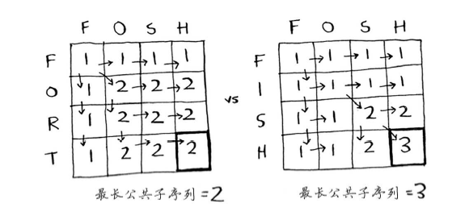

# 最长公共子串和子序列问题
最长公共子串（Longest Common Substring）与最长公共子序列（Longest Common Subsequence）的区别： 
子串要求在原字符串中是连续的，而子序列则只需保持相对顺序一致，并不要求连续。
例如X = {a, Q, 1, 1}; Y = {a, 1, 1, d, f}那么，{a, 1, 1}是X和Y的最长公共子序列，但不是它们的最长公共字串。

## 最长公共子串
使用下面的公式来计算每个单元格的值：


实现这个公式的伪代码如下：
```js
if (word_a[i] == word_b[j]) { //两个字母相同
  cell[i][j] = cell[i-1][j-1] + 1;
} else { //两个字母不同
  cell[i][j] = 0;
}
```

查找单词hish和vista的最长公共子串时，网格如下：


## 最长公共子序列
假如Alex不小心输入了fosh，他原本想输入的是fish还是fort呢？它们的最长公共子串的长度相同，都包含两个字母，
但fosh和fish更像！


求最长公共子序列使用下面的公式：


实现这个公式的伪代码如下：
```js
if (word_a[i] == word_b[j]) { //两个字母相同
  cell[i][j] = cell[i-1][j-1] + 1;
} else { //两个字母不同
  cell[i][j] = Math.max(cell[i-1][j], cell[i][j-1]);
}
```