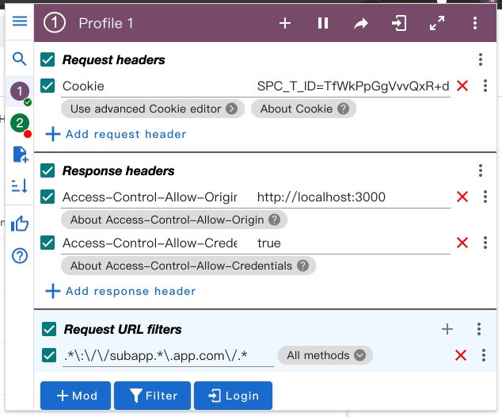
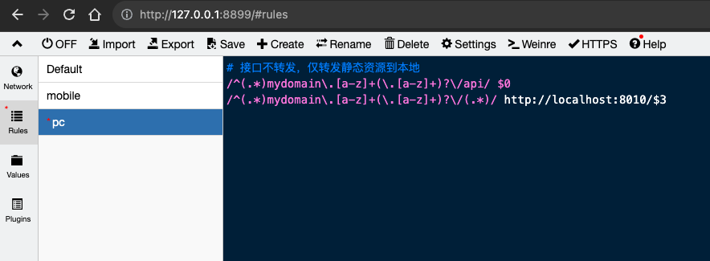
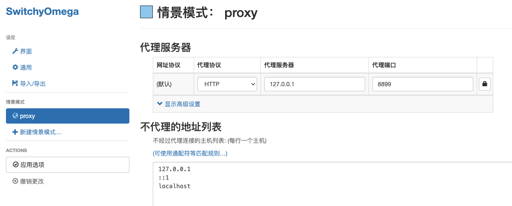
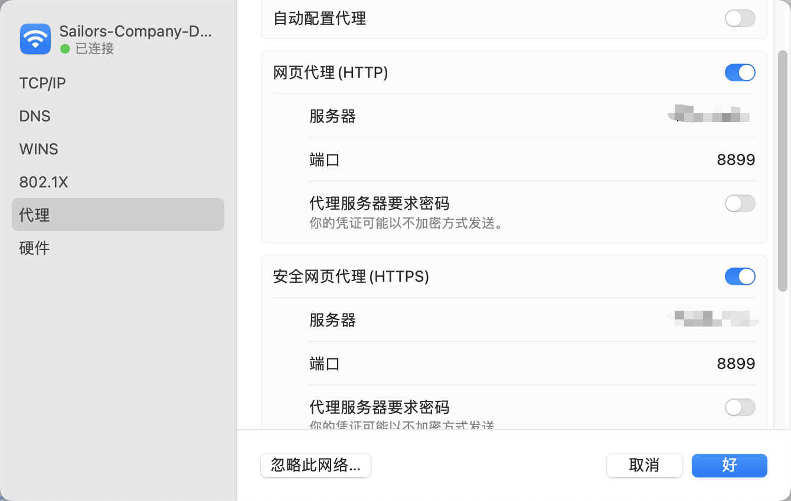
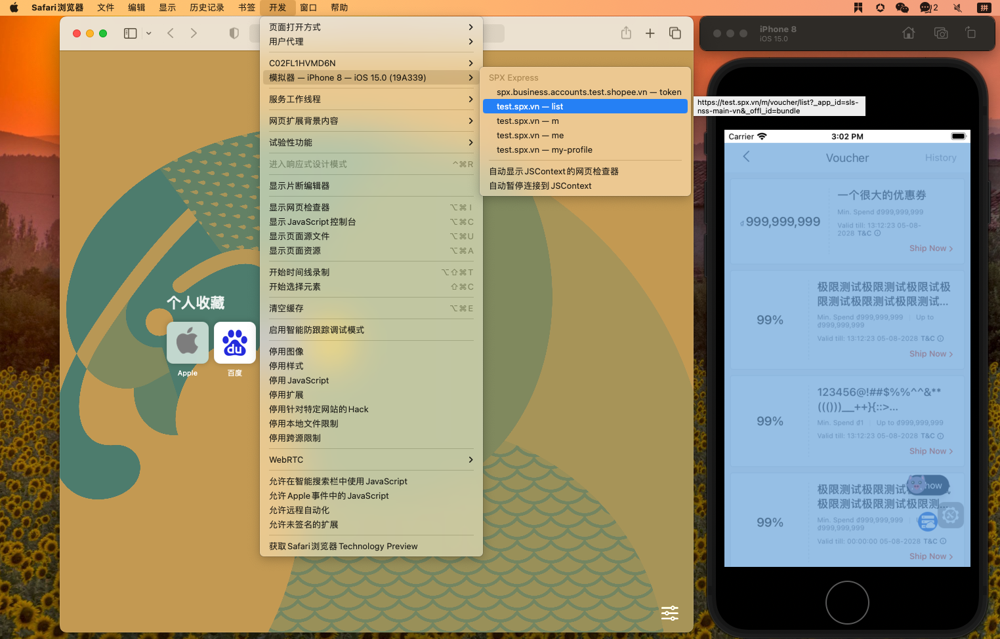

# 本地代理

本地开发环境中经常需要连接其它环境进行调试，或者解决本地登录问题。

## ModHeader
`ModHeader` 是一个 Chrome 浏览器的插件，可以用来修改请求的 header 或者做一些重定向操作。

下图是利用 `ModHeader` 在本地设置 cookie 来绕过登录流程的案例：

## Whistle
whistle 是基于 Node 实现的跨平台 web 调试代理工具，类似的工具有 Windows 平台上的 Fiddler，主要用于查看、修改HTTP、HTTPS、Websocket的请求、响应，也可以作为HTTP代理服务器使用，不同于Fiddler通过断点修改请求响应的方式，whistle采用的是类似配置系统hosts的方式，一切操作都可以通过配置实现，支持域名、路径、正则表达式、通配符、通配路径等多种匹配方式，且可以通过Node模块扩展功能。

下面是借助 whistle 将多个环境代理到本地的例子（whistle的详细使用方式可以参考：https://wproxy.org/whistle/）。

1. 全局安装whistle到本地 
`npm install -g whistle`

2. 控制台启动 whistle，启动后控制台会有提示，默认启动在8899端口，可打开http://127.0.0.1:8899查看效果 
`w2 start`

3. 安装证书  
打开http://127.0.0.1:8899页面，在顶部菜单找到HTTPS配置，点击后会出现一个弹窗，弹窗中需要勾选所有的选项并下载CA证书的链接，下载到本地后同意协议。（更详细的证书安装详见https://wproxy.org/whistle/webui/https.html）

4. 配置规则    

5. 安装浏览器插件 SwitchyOmega，配置代理默认改到127.0.0.1，端口为8899。 

6. 打开要代理的网站，SwitchyOmega 插件选择 proxy 模式。

## iOS 模拟器调试 H5 应用
1. 使用 xcode 安装模拟器，app 安装包可以从电脑拖至模拟器中安装
   
2. 电脑端 wifi 设置代理，WiFi -> 详细信息 -> 代理 -> 网页代理，服务器选项填本机 ip 即可

3. 模拟器浏览器访问 http://rootca.pro 下载 whistle，Settings -> General -> Device Management 安装证书，Settings -> About -> Certificate Trust Settings 信任证书

4. 重新打开 app，启动本地应用， 可加载本地网页

## 电脑端 Safari 调试 Webview

1. 模拟器中启动 app，打开要调试的 h5 页面

2. 电脑端 Safari 浏览器顶部菜单栏选择：开发 -> 模拟器 -> 页面，即可像网页端打开网页检查器调试 webview 中的页面

