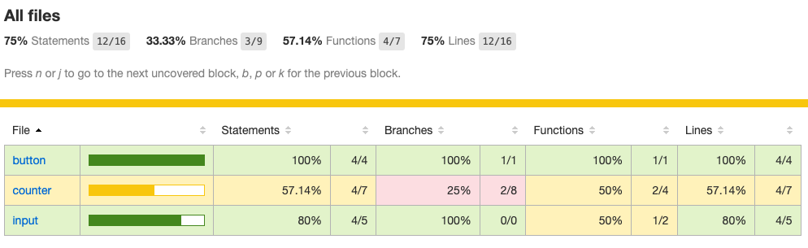

# React 组件单元测试入门指南

## 前言
单元测试是一种自动化测试，测试代码和被测对象非常相关，本文只针对 react 组件的单元测试作一个比较入门的介绍。

单元测试代码一般都有编写对应功能代码的开发者来编写，开发者提交的单元测试代码应该保持一定的覆盖率，而且必须永远能够运行通过。
可以说，单元测试是保护代码质量的第一道防线，也保证了其他开发者不会因为失误破坏原有的功能。

既然说到单元测试，就不得不说测试驱动开发（Test Driven Development，TDD）。在开发之前，先编写好测试用例，总结下来有以下几点好处：

- 在实现细节之前让开发人员专注于 API 的设计，从而获得更好的 API 和可组合性；
- 提供有关文件保存的快速反馈，以告诉开发人员所做的更改是否有效；
- 提供了一个很好的保证，可以增强开发人员在添加功能或重构现有功能时的信心；
- 改进应用程序架构和可维护性；

通常来说，对于纯函数或者纯组件的单测用例是易于编写的，它们不包含任何副作用，对于特定的输入总是可以得到特定的结果。因此，也提倡大家在日常开发中尽可能地编写纯组件，组件内部不维护状态，只接受上层组件传递的 props 来渲染视图，即所谓的“傻瓜组件”。

## 单元测试框架

构建 React 单元测试环境，首先要确定测试框架，在这方面有很多选择，最常见的是以下两种：
- 使用 [Mocha](https://github.com/mochajs/mocha) 测试框架，但是 Mocha 并没有断言库，所以往往还要配合 [Chai](https://github.com/chaijs/chai) 断言库来使用，即 Mocha + Chai 的组合。
- 使用 React 的本家 Facebook 出品的 [Jest](https://github.com/facebook/jest)，它集成了断言、[JSDom](https://github.com/jsdom/jsdom)、Mock、覆盖率报告等工具，功能非常强大。

由于使用 create-react-app 创建的应用中自带了 Jest 库，这里我们也选择 Jest 作为我们的单元测试框架。为了测试 React 组件的渲染，还需要用到一个叫 [Enzyme](https://github.com/enzymejs/enzyme) 的辅助工具，它是 AirBnB 贡献出来的开源项目。

### Jest

Jest 默认会自动在当前目录下寻找满足下列任一条件的 Javascript 文件作为单元测试代码来执行：
- 存于 `__test__` 目录下的代码文件
- 以 `.test.js` 或 `.spec.js` 结尾的代码文件

默认情况下，Jest 已经将一些常用的函数注入到全局环境中，我们无需导入即可直接使用，具体可查看[这里](https://jestjs.io/docs/api)。

单元测试代码最小的单位是测试用例，在 Jest 中测试用例用 `it` 函数代表，一个简单的实例如下：

```js
it('adds 1 + 2 to equal 3', () => {
  expect(sum(1, 2)).toBe(3); // 断言
})
```

为了测试被测对象在多种情况下的行为，通常需要创建多个单元测试用例。如何组织多个单元测试用例，这时**测试套件**就派上了用场。

一个测试套件由测试用例和其他测试套件构成。在 Jest 中用 `describe` 函数描述测试套件，一个测试套件的代码例子如下：

```js
describe('MyComponent', () => {
  it('should render currently', () => {
    // ...
  })
  // 其他的it函数调用或describe函数调用
})
```

将多个 `it` 放到一个 `describe` 中的主要目的是为了重用共同的环境设置，比如 dom 的挂载和卸载。`describe` 中有以下特殊函数可以帮助重用代码：
- **beforeAll**: 在测试套件开始之前执行一次；
- **afterAll**: 在结束测试套件中所有测试用例之后执行一次；
- **beforeEach**: 在每个测试用例执行之前执行一次；
- **afterEach**: 在每个测试用例执行之后执行一次；

另外，Jest 提供了开箱即用的模拟功能，帮助我们替换依赖项或副作用达到隔离测试主题的目的。模拟函数提供了以下功能：
- 捕获调用
- 设置返回值
- 更改实现

Jest 中的模块和函数模拟主要有以下三种类型：
- `jest.fn`：模拟一个函数
- `jest.mock`： 模拟一个模块
- `jest.spyOn`： 监听或模拟一个函数，可以恢复原始实现

### Enzyme

Enzyme 使 React 组件的输出更容易操纵，因为它使用的是 [cheerio](https://github.com/cheeriojs/cheerio) 库来解析虚拟DOM，而 cheerio 相当于服务端的 jQuery。


Enzyme 支持三种渲染方法：
- **shallow**：只渲染顶层 React 组件，不渲染子组件，适合只测试 React 组件的渲染行为；
- **mount**：渲染完整的 React 组件包括子组件，借助模拟的浏览器环境完成事件处理功能；
- **render**：渲染完整的 React 组件，但是只产生 HTML，并不进行事件处理；

要开始使用 Enzyme，除了安装它还需要安装与 React 版本相对应的适配器。 这里我们使用 React 17，可以运行以下命令安装：

```bash
yarn add -D enzyme @wojtekmaj/enzyme-adapter-react-17
```

## 准备工作

create-react-app 虽然自带了 Jest，但是它对我们隐藏了一些配置的细节。为了更清楚的展示 Jest 和 Enzyme 的一些配置，这里我们自己手动搭建一个经典的计数器应用用于演示。当然，我们只讲述与单元测试相关的一些配置，完整的项目信息可在[这里](https://github.com/kaypler/react-unit-test)查看。

Jest 的配置可以在项目的 `package.json` 文件中定义，也可以通过 `jest.config.js` 或 `jest.config.ts` 文件或通过 `--config <path/to/file.js|ts|cjs|mjs|json>` 在脚本命令里指定。这里我们定义在项目根目录的 `unit.jest.js` 文件里：

```js
module.exports = {
  verbose: true, //是否输出每个测试用例的日志
  testEnvironment: "jsdom", //运行测试的环境
  setupFiles: ["./tests/setup.js"], //设置测试环境，将在每个测试文件之前执行
  testMatch: ["**/unit/**/*.(spec|test).(js|ts|jsx|tsx)"], // 匹配测试文件
  collectCoverage: true, // 是否收集测试覆盖率
  collectCoverageFrom: [
    // 指定要收集或排除那些文件的测试覆盖率
    "src/components/**/*.(js|ts|jsx|tsx)",
    "!src/components/**/*.(spec|test).(js|ts|jsx|tsx)",
  ],
};
```

`setup.js` 里主要配置了 Enzyme 的适配器信息：

```js
const Enzyme = require('enzyme');

const Adapter = require('@wojtekmaj/enzyme-adapter-react-17')
Enzyme.configure({ adapter: new Adapter() });
```

其他的一些配置可参考 Jest 的[官方文档](https://jestjs.io/docs/configuration)。接下来，在 `package.json` 里增加以下脚本：

```json
"test": "jest --config unit.jest.js", // 运行测试命令
"test:watch": "jest --watch --config unit.jest.js", // 在文件变更时重新运行测试命令
"test:update": "jest --updateSnapshot --config unit.jest.js" // 更新快照
```

整个应用主要包含三个组件： `Counter`、`Input`、`Button`，Counter 是一个容器组件，里面维护了一个 count 的状态，当点击按钮或者输入框的值改变都会更新它的状态；而 Input 和 Button 都是纯组件，只会接受父组件传递的 props。

Counter 组件：

```tsx
import * as React from 'react';
import Input from '../input';
import Button from '../button';

interface CounterProps {}
interface CounterState {
  count: number | undefined;
}

class Counter extends React.Component<CounterProps, CounterState> {
  state = {
    count: 0,
  }
  increment = () => {
    this.setState({ count: (this.state.count || 0)+1 });
  }
  handleInputChange = (value: string) => {
    if (!isNaN(Number(value))) {
      this.setState({ count: value === '' ? undefined : Number(value) });
    }
  }
  componentDidMount() {}

  render() {
    return (
      <div className="counter">
        <Input value={String(this.state.count || '')} onChange={this.handleInputChange} />
        <Button text="Increment" type="success" onClick={this.increment} />
      </div>
    );
  }
}

export default Counter;
export type { CounterProps };
```

Input 组件:

```tsx
import * as React from 'react';

interface InputProps {
  value?: string;
  onChange?: (val: string) => void;
}

const Input = React.forwardRef<HTMLInputElement, InputProps>((props, ref) => {
  const {
    value,
    onChange,
  } = props;
  const handleChange = (e: React.ChangeEvent<HTMLInputElement>) => {
    onChange?.(e.target.value)
  }
  return (
    <input ref={ref} value={value} onChange={handleChange} />
  );
});

export default Input;
export type {InputProps};
```

Button 组件：

```tsx
import * as React from 'react';
import classnames from 'classnames';

interface ButtonProps {
  type?: 'primary' | 'success' | 'warning' | 'danger';
  text: string;
  onClick?: () => void;
}

const Button: React.FunctionComponent<ButtonProps> = (props) => {
  const {
    type = 'primary',
    text,
    onClick,
  } = props;
  const cls = classnames('button', `is-${type}`);
  return (
    <button className={cls} onClick={onClick}>{text}</button>
  );
}

export default Button;
export type {ButtonProps};
```

准备工作就到这了，接下来就可以愉快地写测试用例啦～

## 测试挂载和卸载
与 `shallow` 和 `render` 不同， `mount` 是会将组件安装在 DOM 中，意味着如果测试用例都使用相同的 DOM，则测试可能会相互影响；如有必要，可以使用·`unmount` 方法进行清理。

```js
import React from 'react';
import { mount } from 'enzyme';
import Counter from '../index';

describe(`Counter`, () => {
  it(`could be mounted without errors`, () => {
    expect(() => mount(<Counter />)).not.toThrow();
  });

  it(`could be unmounted without errors`, () => {
    const wrapper = mount(<Counter />);
    expect(() => {
      wrapper.unmount();
    }).not.toThrow();
  });
});
```

## 测试组件生命周期
这里我们使用 `jest.spyOn` 来捕获组件生命周期方法 `componentDidMount` 的调用，来测试组件的生命周期，并在最后通过 `mockRestore` 方法来恢复 `componentDidMount` 的原始实现。这对于同一文件中的测试很有用，但不需要在 `afterAll` 钩子中进行，因为 Jest 中的每个测试文件都是沙盒的，不会互相影响。

```js
describe(`Counter`, () => {
  it('should call componentDidMount', () => {
    const spy = jest.spyOn(Counter.prototype, 'componentDidMount');
    const wrapper = mount(<Counter />);
    expect(spy).toHaveBeenCalledTimes(1);
    // 恢复原始实现
    spy.mockRestore();
  });
});
```

## 测试属性和事件
这个例子中我们利用 `beforeAll` 和 `afterAll` 钩子进行组件的挂载和卸载，这样可以在多个测试用例中共享同一个组件实例，避免频繁渲染组件造成额外的消耗。另外，通过 Enzyme 渲染后的实例提供的 `simulate` 方法模拟触发了按钮的点击事件。

```js
describe(`Button`, () => {
  let instance;
  const mockFn = jest.fn();

  beforeAll(() => {
    instance = mount(<Button onClick={mockFn}></Button>)
  })

  afterAll(() => {
    instance.unmount();
  })

  it(`could call the onClick event`, () => {
    instance.find('button').simulate('click');
    expect(mockFn).toHaveBeenCalled();
  });

  it(`could change the props`, () => {
    instance.setProps({ type: 'success' });
    expect(instance.props().type).toEqual('success');
  });
});
```

## 测试样式
为了排除子组件样式可能造成的影响，这里我们使用 `shallow` 来只渲染当前组件。

```js
describe(`Counter`, () => {
  it('could render an `.counter`', () => {
    const wrapper = shallow(<Counter />);
    expect(wrapper.find('.counter')).toHaveLength(1);
  });
});
```

## 测试 Ref
同样，利用 `jest.fn` 或 `jest.spyOn` 可以很方便地测试组件的 ref 属性。这个示例里的 ref 属性引用的是 Input 组件内部原生的 input 标签，我们通过监听 input 标签的 focus 事件是否被调用来测试 ref 属性是否被正确绑定；另外，我们通过 `mockImplementation` 方法重新实现了 input 标签的 focus 函数使其可以接受一个参数。

```js
describe('Input', () => {
  it('should bind ref currently', () => {
    const ref = React.createRef<HTMLInputElement>(null);
    const spy = jest.spyOn(HTMLInputElement.prototype, 'focus');
    // 更改函数实现
    spy.mockImplementation((val) => val);
    mount(<Input ref={ref} />);
    ref.current.focus('mock');
    expect(spy).toHaveBeenCalledWith('mock');
    spy.mockRestore();
  })
});
```

## 生成快照
快照可以测试到组件的渲染结果是否与上一次生成的快照一致。`toMatchSnapshot` 方法会在当前测试文件同级目录下新建一个名为 `__snapshots__` 的文件夹存放当前组件的快照文件，如果快照文件已存在，则对比这次将要生成的结构与上次的区别。如果组件的 dom 结构确实发生了变化，需要执行 `jest -u` 命令更新快照。

```js
import React from 'react';
import { render } from 'enzyme';
import toJson from "enzyme-to-json";
import Input from '../index';

describe('Input', () => {
  it('should match snapshot', () => {
    const wrapper = render(<Input value="3" />);
    expect(toJson(wrapper)).toMatchSnapshot();
  })
});
```

## 测试覆盖率

由于我们在 `unit.jest.js` 里配置了 `collectCoverage: true` 选项，每次我们跑完 jest 命令，Jest 都会为我们生成一份测试覆盖率报告，在项目 `coverage/Icov-report` 目录下可查看 html 格式的详细的测试率报告。



## 总结
以上总结了 React 组件一些常见的单元测试场景。俗话说的好，单测写得好，bug 出得少，希望大家在日常开发中多多写单元测试，爱上写单元测试。

## 参考
1. [Testing Recipes](https://reactjs.org/docs/testing-recipes.html)
2. [Unit Testing React Components](https://medium.com/javascript-scene/unit-testing-react-components-aeda9a44aae2)