# K线图形态

## 锤子线和上吊线
一般根据三个方面的标准来识别锤子线和上吊线： 
1. 实体处于整个价格区间的上端，但实体本身的颜色无所谓。 
2. 带有长长的下影线，且下影线的长度至少达到实体高度的两倍。 
3. 在这类蜡烛线中，应当没有上影线；即使有上影线，长度也是极短的。

### 锤子线（Hammer）
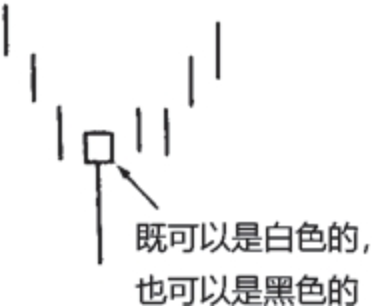

锤子线带有长长的下影线，且收市于本时段最高价，或接近最高价，意味着在当天的交易过程中，市场起先曾急剧下挫，后来却完全反弹上来，收市在当日的最高价处，或者收市在接近最高价的水平上。这一点本身就具有看涨的味道。

### 上吊线（Hanging Man）
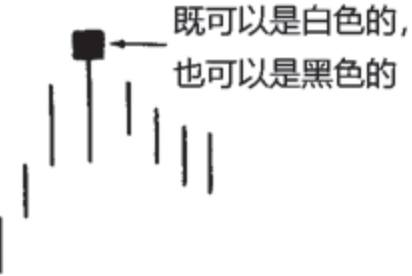

上吊线的形状与锤子线相同，唯一区别是，上吊线出现在上涨行情之后。上吊线出现后，一定要等待其他看跌信号的证实，这一点特别重要。最低限度的验证信号是，收市价低于上吊线的实体。

## 吞没形态
关于吞没形态，我们有三条判别标准： 
1. 在吞没形态之前，市场必须处在明确的上升趋势（看跌吞没形态）或下降趋势（看涨吞没形态）中，哪怕这个趋势只是短期的。 
2. 吞没形态由两条蜡烛线组成。其中第二根蜡烛线的实体必须覆盖第一根蜡烛线的实体（但是不一定需要吞没前者的上下影线）。 
3. 吞没形态的第二个实体应与第一个实体的颜色相反。（这一条标准有例外的情况，条件是，吞没形态的第一条蜡烛线是一根十字线。如此一来，如果在长时间的下降趋势之后，一个小小的十字线被一个巨大的白色实体所吞没，就可能构成底部反转形态。反之，在上升趋势中，如果一个十字线被一个巨大的黑色实体所吞没，就可能构成顶部反转形态）。

如果吞没形态具有这样的特征，那么它构成重要反转信号的可能性将大大增强： 
1. 如果在吞没形态中，第一天的实体非常小（即纺锤线），而第二天的实体非常大。第一天蜡烛线的小实体反映出原有趋势的驱动力正在消退，而第二天蜡烛线的长实体证明新趋势的潜在力量正在壮大。 
2. 如果吞没形态出现在超长延伸的或非常快速的市场运动之后。如果存在非常快速的或超长程的行情运动，则导致市场朝一个方向走得太远（要么超买，要么超卖），容易遭受获利平仓头寸的打击。 
3. 如果在吞没形态中，第二个实体伴有超额的交易量。我们将在第二部分讨论交易量分析。

吞没形态的一种主要作用是构成支撑水平或阻挡水平。在组成看跌吞没形态的两根蜡烛线中，选取其最高点（上影线的最高点）。该高点构成了阻挡水平（以收市价来观察突破与否）。把同样的概念运用到看涨吞没形态。该形态的最低点（下影线的最低点）构成了支撑水平。

将吞没形态看作阻挡水平和支撑水平，是一个很有用的技巧，尤其当市场离开低点过远时（看涨吞没形态）或离开高点过远时（看跌吞没形态），可以借之选择更舒适的卖出或买进点。举例来说，等到看涨吞没形态完成时（请记住，我们需要一直等到本时段收市时才能确认当前蜡烛线组合属于看涨吞没形态），市场可能已经远离之前的低点了。因此，我会觉得行情已经离开了有吸引力的买进区域。在这种情况下，我们可以等待市场调整，它可能再次进入看涨吞没形态低点附近的支撑区域，然后，再考虑入市做多。在看跌吞没形态的情况下，同样的道理，而方向相反。

### 看涨吞没
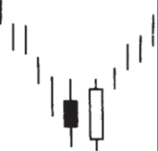

### 看跌吞没
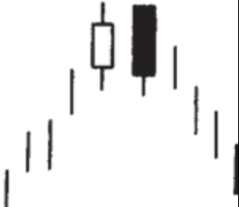

## 乌云盖顶形态
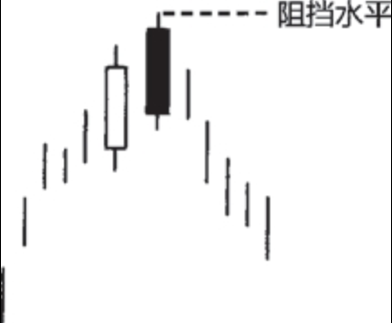

这种形态也是由两根蜡烛线组成的，属于顶部反转形态。它一般出现在上升趋势之后，有些情况下也可能出现在水平调整区间的顶部。在这一形态中，第一天是一根坚挺的白色实体；第二天的开市价超过了第一天的最高价（就是说超过了第一天上影线的顶端），但是到了第二天收市的时候，市场却收市在接近当日最低价的水平，并且明显地向下扎入第一天白色实体的内部。第二天的黑色实体向下穿进第一天的白色实体的程度越深，则该形态构成顶部反转形态的可能性就越大。有些技术分析师要求，第二天黑色实体的收市价必须向下穿过前一天白色实体的50%。如果黑色实体的收市价没有向下穿过白色蜡烛线的中点，那么，当这类乌云盖顶形态发生后，或许我们最好等一等，看看是否还有进一步的看跌验证信号。

## 刺透形态
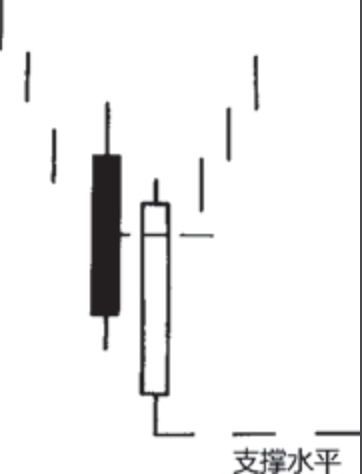

有一个与乌云盖顶形态相反的形态，它的名称为**刺透形态**。刺透形态出现在下跌的市场上，也是由两根蜡烛线所组成的。其中第一根蜡烛线具有黑色实体，而第二根蜡烛线则具有白色实体。在白色蜡烛线这一天，市场的开市价曾跌到低位，最好下跌至前一个黑色蜡烛线的最低价之下，但是后来市场又将价格推升回来，深深刺入黑色蜡烛线的实体内部。在理想的刺透形态中，白色实体必须向上穿入前一个黑色实体的中点水平以上。

## 星线
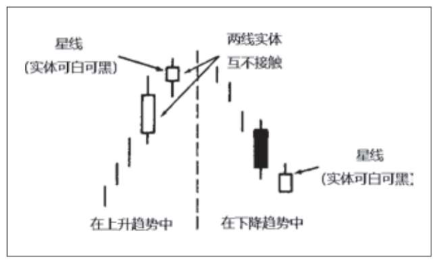

**星线**的实体较小（可以是白色，也可以是黑色），并且在它的实体与它前面较大的蜡烛线实体之间形成了价格跳空。

星线较小的实体显示，空头和多头的拔河已经转入僵持状态。在强劲的上升趋势中，多头一直掌握主导地位。在这种情况下，如果出现了一根星线，则构成警告信号。如果在下降趋势中出现了星线，也是同样的道理，只是方向相反。

### 十字星线
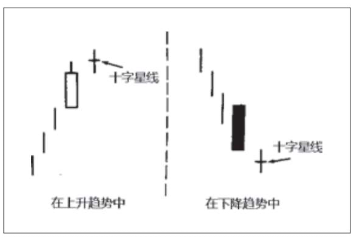

如果星线的实体已经缩小为十字线，则称之为**十字星线**。

## 启明星形态
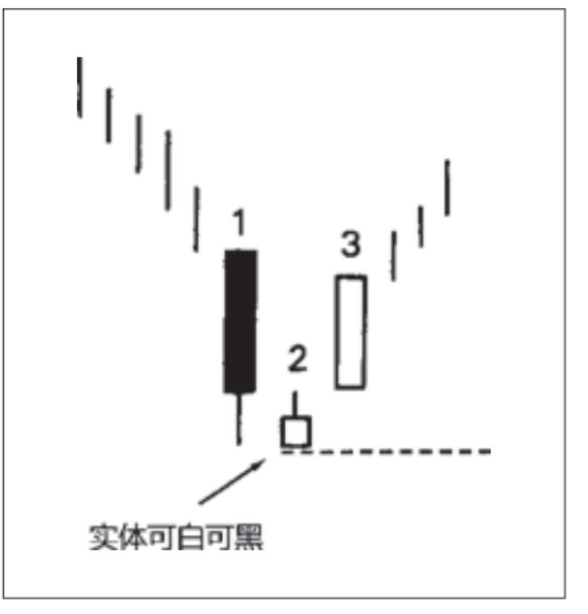

**启明星形态**属于底部反转形态。它的名称由来是，就像启明星预示着太阳的升起一样，这个形态预示着价格的上涨。本形态由三根蜡烛线组成： 
- 蜡烛线1：一根长长的黑色实体，形象地表明空头占据主宰地位。 
- 蜡烛线2：一根小小的实体，并且它与前一根实体之间不相接触（这两条蜡烛线组成了基本的星线形态）。小实体意味着卖方丧失了驱动市场走低的能力。 
- 蜡烛线3：一根白色实体，它明显地向上推进到了第一个时段的黑色实体之内，标志着启明星形态的完成。这表明多头已经夺回了主导权。 

在理想的启明星形态中，第二根蜡烛线（即星线）的实体，与第三根蜡烛线的实体之间有价格跳空。根据我的经验，即使没有这个价格跳空，似乎也不会削减启明星形态的技术效力。其决定性因素是，第二根蜡烛线应为纺锤线，同时第三根蜡烛线应显著深入到第一根黑色蜡烛线内部。

启明星形态的不足之处是，既然形态由三根蜡烛线组成，就得等到其中第三个时段收市时，形态才算完成。在通常情况下，如果第三根蜡烛线是长长的白色线，那么当我们得到信号的时候，市场已经走过一段急速反弹了。换句话说，当启明星形态完成时，或许并不能提供风险报偿比具有吸引力的交易机会。针对这一点，一种选择是等待行情回落到启明星形态构成的支撑区域时，再小口小口地吃进做多。

## 黄昏星形态
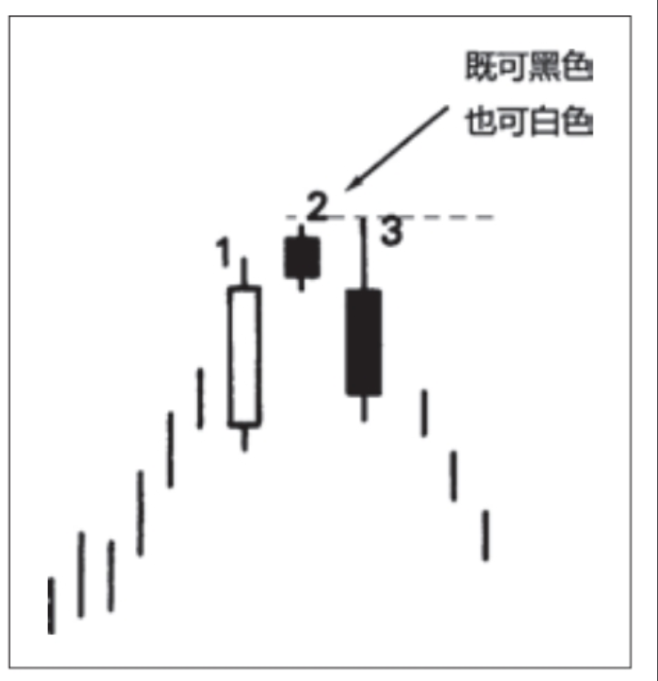

原则上说，在黄昏星形态中，首先在第一根实体与第二根实体之间，应当形成价格跳空；然后在第二根实体与第三根实体之间，再形成另一个价格跳空。但是，上述第二个价格跳空并不常见，而且对本形态的成功来说可有可无，不是必要条件。本形态的关键之处在于第三天的黑色实体向下穿入第一天的白色实体的深浅程度。

## 流星形态
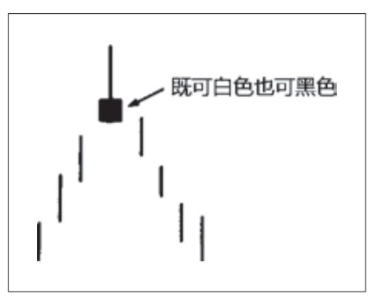

在**流星形态**中，流星线具有较小的实体，而且实体处于其价格区间的下端，同时，流星线的上影线较长。我们可以看出其名称的由来，它的外观恰如其名称，像一颗流星，带着熊熊燃烧的长尾巴划过天际。既然它只是一个时段，通常不像看跌吞没形态或黄昏星形态那样构成主要反转信号。它与上述两个形态还有一点不同，我不认为流星线构成了关键阻挡水平。

## 倒锤子线
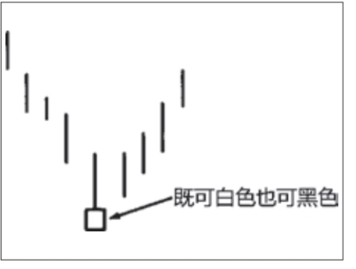

**倒锤子线**看上去与流星线颇为相像，它也有较长的上影线和较小的实体，并且实体居于整个价格范围的下端。两者之间唯一不同的是，倒锤子线出现在下降行情之后。结果，流星线是一根顶部反转蜡烛线，而倒锤子线却是一根底部反转蜡烛线。

正如上吊线需要其他看跌信号的验证，倒锤子线也需要其他看涨信号的验证。验证信号既可以是次日开市价高于倒锤子线的实体，也可以是次日收市价高于倒锤子线的实体，尤其是后者更为有力。

## 孕线形态

