# K线图形态

## 锤子线和上吊线
一般根据三个方面的标准来识别锤子线和上吊线： 
1. 实体处于整个价格区间的上端，但实体本身的颜色无所谓。 
2. 带有长长的下影线，且下影线的长度至少达到实体高度的两倍。 
3. 在这类蜡烛线中，应当没有上影线；即使有上影线，长度也是极短的。

### 锤子线（Hammer）

锤子线带有长长的下影线，且收市于本时段最高价，或接近最高价，意味着在当天的交易过程中，市场起先曾急剧下挫，后来却完全反弹上来，收市在当日的最高价处，或者收市在接近最高价的水平上。这一点本身就具有看涨的味道。

### 上吊线（Hanging Man）

上吊线的形状与锤子线相同，唯一区别是，上吊线出现在上涨行情之后。上吊线出现后，一定要等待其他看跌信号的证实，这一点特别重要。最低限度的验证信号是，收市价低于上吊线的实体。

## 吞没形态
关于吞没形态，我们有三条判别标准： 
1. 在吞没形态之前，市场必须处在明确的上升趋势（看跌吞没形态）或下降趋势（看涨吞没形态）中，哪怕这个趋势只是短期的。 
2. 吞没形态由两条蜡烛线组成。其中第二根蜡烛线的实体必须覆盖第一根蜡烛线的实体（但是不一定需要吞没前者的上下影线）。 
3. 吞没形态的第二个实体应与第一个实体的颜色相反。（这一条标准有例外的情况，条件是，吞没形态的第一条蜡烛线是一根十字线。如此一来，如果在长时间的下降趋势之后，一个小小的十字线被一个巨大的白色实体所吞没，就可能构成底部反转形态。反之，在上升趋势中，如果一个十字线被一个巨大的黑色实体所吞没，就可能构成顶部反转形态）。

如果吞没形态具有这样的特征，那么它构成重要反转信号的可能性将大大增强： 
1. 如果在吞没形态中，第一天的实体非常小（即纺锤线），而第二天的实体非常大。第一天蜡烛线的小实体反映出原有趋势的驱动力正在消退，而第二天蜡烛线的长实体证明新趋势的潜在力量正在壮大。 
2. 如果吞没形态出现在超长延伸的或非常快速的市场运动之后。如果存在非常快速的或超长程的行情运动，则导致市场朝一个方向走得太远（要么超买，要么超卖），容易遭受获利平仓头寸的打击。 
3. 如果在吞没形态中，第二个实体伴有超额的交易量。我们将在第二部分讨论交易量分析。

吞没形态的一种主要作用是构成支撑水平或阻挡水平。在组成看跌吞没形态的两根蜡烛线中，选取其最高点（上影线的最高点）。该高点构成了阻挡水平（以收市价来观察突破与否）。把同样的概念运用到看涨吞没形态。该形态的最低点（下影线的最低点）构成了支撑水平。

将吞没形态看作阻挡水平和支撑水平，是一个很有用的技巧，尤其当市场离开低点过远时（看涨吞没形态）或离开高点过远时（看跌吞没形态），可以借之选择更舒适的卖出或买进点。举例来说，等到看涨吞没形态完成时（请记住，我们需要一直等到本时段收市时才能确认当前蜡烛线组合属于看涨吞没形态），市场可能已经远离之前的低点了。因此，我会觉得行情已经离开了有吸引力的买进区域。在这种情况下，我们可以等待市场调整，它可能再次进入看涨吞没形态低点附近的支撑区域，然后，再考虑入市做多。在看跌吞没形态的情况下，同样的道理，而方向相反。

### 看涨吞没

### 看跌吞没

## 乌云盖顶形态

这种形态也是由两根蜡烛线组成的，属于顶部反转形态。它一般出现在上升趋势之后，有些情况下也可能出现在水平调整区间的顶部。在这一形态中，第一天是一根坚挺的白色实体；第二天的开市价超过了第一天的最高价（就是说超过了第一天上影线的顶端），但是到了第二天收市的时候，市场却收市在接近当日最低价的水平，并且明显地向下扎入第一天白色实体的内部。第二天的黑色实体向下穿进第一天的白色实体的程度越深，则该形态构成顶部反转形态的可能性就越大。有些技术分析师要求，第二天黑色实体的收市价必须向下穿过前一天白色实体的50%。如果黑色实体的收市价没有向下穿过白色蜡烛线的中点，那么，当这类乌云盖顶形态发生后，或许我们最好等一等，看看是否还有进一步的看跌验证信号。

## 刺透形态

有一个与乌云盖顶形态相反的形态，它的名称为**刺透形态**。刺透形态出现在下跌的市场上，也是由两根蜡烛线所组成的。其中第一根蜡烛线具有黑色实体，而第二根蜡烛线则具有白色实体。在白色蜡烛线这一天，市场的开市价曾跌到低位，最好下跌至前一个黑色蜡烛线的最低价之下，但是后来市场又将价格推升回来，深深刺入黑色蜡烛线的实体内部。在理想的刺透形态中，白色实体必须向上穿入前一个黑色实体的中点水平以上。

## 星线

**星线**的实体较小（可以是白色，也可以是黑色），并且在它的实体与它前面较大的蜡烛线实体之间形成了价格跳空。

星线较小的实体显示，空头和多头的拔河已经转入僵持状态。在强劲的上升趋势中，多头一直掌握主导地位。在这种情况下，如果出现了一根星线，则构成警告信号。如果在下降趋势中出现了星线，也是同样的道理，只是方向相反。

### 十字星线

如果星线的实体已经缩小为十字线，则称之为**十字星线**。

## 启明星形态

**启明星形态**属于底部反转形态。它的名称由来是，就像启明星预示着太阳的升起一样，这个形态预示着价格的上涨。本形态由三根蜡烛线组成： 
- 蜡烛线1：一根长长的黑色实体，形象地表明空头占据主宰地位。 
- 蜡烛线2：一根小小的实体，并且它与前一根实体之间不相接触（这两条蜡烛线组成了基本的星线形态）。小实体意味着卖方丧失了驱动市场走低的能力。 
- 蜡烛线3：一根白色实体，它明显地向上推进到了第一个时段的黑色实体之内，标志着启明星形态的完成。这表明多头已经夺回了主导权。 

在理想的启明星形态中，第二根蜡烛线（即星线）的实体，与第三根蜡烛线的实体之间有价格跳空。根据我的经验，即使没有这个价格跳空，似乎也不会削减启明星形态的技术效力。其决定性因素是，第二根蜡烛线应为纺锤线，同时第三根蜡烛线应显著深入到第一根黑色蜡烛线内部。

启明星形态的不足之处是，既然形态由三根蜡烛线组成，就得等到其中第三个时段收市时，形态才算完成。在通常情况下，如果第三根蜡烛线是长长的白色线，那么当我们得到信号的时候，市场已经走过一段急速反弹了。换句话说，当启明星形态完成时，或许并不能提供风险报偿比具有吸引力的交易机会。针对这一点，一种选择是等待行情回落到启明星形态构成的支撑区域时，再小口小口地吃进做多。

## 黄昏星形态

原则上说，在黄昏星形态中，首先在第一根实体与第二根实体之间，应当形成价格跳空；然后在第二根实体与第三根实体之间，再形成另一个价格跳空。但是，上述第二个价格跳空并不常见，而且对本形态的成功来说可有可无，不是必要条件。本形态的关键之处在于第三天的黑色实体向下穿入第一天的白色实体的深浅程度。

## 流星形态

在**流星形态**中，流星线具有较小的实体，而且实体处于其价格区间的下端，同时，流星线的上影线较长。我们可以看出其名称的由来，它的外观恰如其名称，像一颗流星，带着熊熊燃烧的长尾巴划过天际。既然它只是一个时段，通常不像看跌吞没形态或黄昏星形态那样构成主要反转信号。它与上述两个形态还有一点不同，我不认为流星线构成了关键阻挡水平。

## 倒锤子线

**倒锤子线**看上去与流星线颇为相像，它也有较长的上影线和较小的实体，并且实体居于整个价格范围的下端。两者之间唯一不同的是，倒锤子线出现在下降行情之后。结果，流星线是一根顶部反转蜡烛线，而倒锤子线却是一根底部反转蜡烛线。

正如上吊线需要其他看跌信号的验证，倒锤子线也需要其他看涨信号的验证。验证信号既可以是次日开市价高于倒锤子线的实体，也可以是次日收市价高于倒锤子线的实体，尤其是后者更为有力。

## 孕线形态
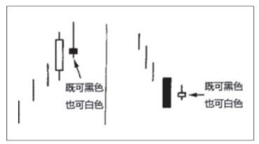

**孕线形态**其中后面一根蜡烛线的实体较小，并且被前一根的实体包进去了。

在牛市行情中，孕线形态的前一个长长的白色实体表现出市场本来充满了活力，但是后一个小小的实体却反映出市场犹疑不定。不仅如此，小实体的开市价和收市价都收缩到前一根蜡烛线的开市价到收市价的范围内，从另一个侧面表明牛方向上的推动力正在衰退。由此看来，有可能发生趋势反转。在熊市行情中，孕线形态的前一个长长的黑色蜡烛线反映了沉重的抛售压力，但是，随后的小实体却表明市场踌躇不前。第二天的小实体是个警告信号，说明熊方的力量正在减弱，因此本形态可能构成趋势反转信号。于是，有可能发生趋势反转。 

**十字孕线形态**包含了一根十字蜡烛线，所以这类形态的技术意义比常规孕线形态更强，被视为更有效的反转信号。十字孕线形态有时也称为**呆滞形态**。

## 平头顶部形态和平头底部形态
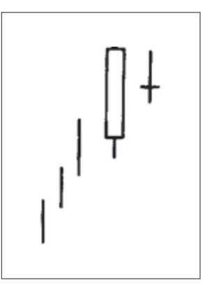

**平头形态**是由几乎具有相同水平的最高点的两根蜡烛线组成的，或者是由几乎具有相同的最低点的两根蜡烛线组成的。之所以将这种形态称为**平头顶部形态**和**平头底部形态**，是因为这些蜡烛线的端点就像镊子腿一样平齐。在上升的市场中，当几根蜡烛线的最高点的位置不相上下时，就形成了一个平头顶部形态。在下跌的市场中，当几根蜡烛线的最低点的位置基本一致时，就形成了一个平头底部形态。

**平头形态**既可以由实体构成，也可以由影线或者十字线构成。在理想情况下，平头形态应当由前一根长实体蜡烛线与后一根小实体蜡烛线组合而成。这样就表明，无论在第一个时段市场展现了什么样的力量（如果是长白色实体，展现的便是看涨的力量；如果是长黑色实体，展现的便是看跌的力量），到了第二个时段都被瓦解了，因为第二个时段是一个小实体，且其高点与第一个时段的高点相同（在平头顶部形态中），或其低点与第一个时段的低点相同（在平头底部形态中）。如果一个看跌的（对于顶部反转）蜡烛图信号，或看涨的（对于底部反转）蜡烛图信号，同时构成了一个平头形态，该形态就多了一些额外的技术分量。

## 捉腰带形态
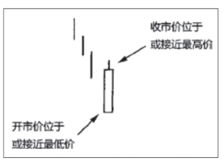

**捉腰带形态**是由单独一根蜡烛线构成的。看涨捉腰带形态是一根坚挺的白色蜡烛线，其开市价位于本时段的最低点（或者，这根蜡烛线只有极短的下影线），然后市场一路上扬，收市价位于或接近本时段的最高点。看涨捉腰带线又称为**开盘光脚阳线**。如果市场本来处于低价区域，这时出现了一根长长的看涨捉腰带线，则预示着上冲行情的到来。 

**看跌捉腰带形态**是一根长长的黑色蜡烛线，它的开市价位于本时段的最高点（或者距离最高价只有几个最小报价单位），然后市场一路下跌。在市场处于高价区的条件下，看跌捉腰带形态的出现，就构成了顶部反转信号。看跌捉腰带线有时也称为**开盘光头阴线**。

如果市场收市于黑色的看跌捉腰带线之上，则意味着上升趋势已经恢复。如果市场收市于白色的看涨捉腰带线之下，则意味着市场的抛售压力重新积聚起来了。

## 向上跳空两只乌鸦
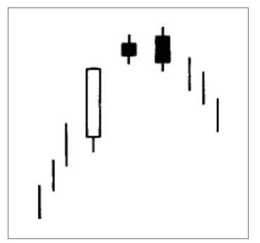

**向上跳空两只乌鸦形态**，它很罕见。“向上跳空”指的是图示的小黑色实体与它们之前的实体（第一个小黑色实体之前的实体，通常是一根长长的白色实体）之间的价格跳空。从这个形象的比喻来看，显而易见，这是一种看跌的价格形态。在理想的向上跳空两只乌鸦形态中，第二个黑色实体的开市价高于第一个黑色实体的开市价，并且它的收市价低于第一个黑色实体的收市价。 
 
这个形态在技术上看跌的理论依据大致如下：市场本来处于上升趋势中，并且这一天的开市价同前一天的收市价相比，是向上跳空的，可是市场不能维持这个新高水平，结果当天反而形成了一根黑色蜡烛线。到此时为止，多头至少还能捞着几根救命稻草，因为这根黑色蜡烛线还能够维持在前一天的收市价之上。第三天，又为市场抹上了更深的疲软色彩：当天市场曾经再度创出新高，但是同样未能将这个新高水平维持到收市的时候。然而更糟糕的是，第三日的收市价低于第二日的收市价。如果市场果真如此坚挺，那么为什么它不能维持新高水平呢？

## 三只乌鸦
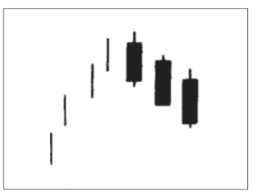

在向上跳空两只乌鸦形态中，包含了两根黑色蜡烛线。如果连续出现了三根依次下降的黑色蜡烛线，则构成了所谓的**三只乌鸦形态**。如果三只乌鸦形态出现在高价格水平上，或者出现在经历了充分延伸的上涨行情中，就预示着价格即将下跌。

从外形上说，这三根黑色蜡烛线的收市价都应当处于其最低点，或者接近其最低点。在理想的情形下，每根黑色蜡烛线的开市价也都应该处于前一个实体的范围之内。

## 三色白兵挺进形态
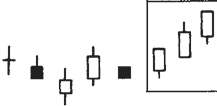

**白三兵形态**表现为一个逐渐而稳定的上升过程，其中每根白色蜡烛线的开市价都处于前一天的白色实体之内，或者处在其附近的位置上。每一根白色蜡烛线的收市价都应当位于当日的最高点或接近当日的最高点。这是市场的一种很稳健的攀升方式（不过，如果这些白色蜡烛线伸展得过长，那么我们也应当对市场的超买状态有所戒备）。 

如果其中的第二根和第三根蜡烛线，或者仅仅是第三根蜡烛线，表现出上涨势头减弱的迹象，那就构成了一个**前方受阻形态**。在前方受阻形态中，作为上涨势头减弱的具体表现，既可能是其中的白色实体一个比一个小，也可能是后两根白色蜡烛线具有相对较长的上影线。如果在后两根蜡烛线中，前一根为长长的白色实体，并且向上创出了新高，后一根只是一个小的白色蜡烛线，那么就构成了一个**停顿形态**。当停顿形态发生时，便构成了多头头寸平仓获利的紧要时机。

在白三兵形态出现后，一旦行情调整，则其中的第一根或第二根白色蜡烛线，即白三兵的起点处，经常构成支撑水平。

## 三山形态和三川形态
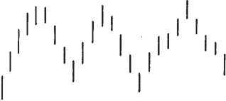

**三山形态**构成了一种主要顶部反转过程。如果市场先后三次均从某一个高价位上回落下来，或者市场对某一个高价位向上进行了三次尝试，但都失败了，那么一个三山顶部形态就形成了。在三山顶部形态的最后一座山的最高点，还应当出现一种看跌的蜡烛图指标（比如说，一根十字线，或者一个乌云盖顶形态等），对三山顶部形态做出确认。

在三山顶部形态中，如果中间的山峰高于两侧的山峰，则构成了一种特殊的三山形态，称为**三尊顶部形态**”。

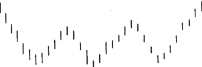

**三川底部形态**恰巧是三山顶部形态的反面。在市场先后三度向下试探某个底部水平后，就形成了这类形态。市场必须向上突破这个底部形态的最高水平，才能证实底部过程已经完成。与西方的头肩形底部形态（也称为倒头肩形）对等的蜡烛图形态是变体三川底部形态，或者称为**倒三尊形态**。

## 反击线形态
当两根颜色相反的蜡烛线具有相同的收市价时，就形成了一个**反击线形态**。

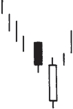

**看涨反击形态**出现在下降行情中。在这个形态中，第一根蜡烛线是一根长长的黑色蜡烛线。在第二根蜡烛线上，市场的开市价急剧地向下跳空。到此刻为止，空头觉得信心十足。但是从这时候起，多头发动了反攻，他们把市场推了上来，使价格重新回到了前一天收市价的水平。 

**刺透形态**与看涨反击线形态相比较，是一种更为重要的底部反转信号。

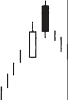

**看跌反击形态**，第一根蜡烛线是长长的白色蜡烛线，保持了牛市一贯的上升动力。在下一根蜡烛线上，市场在开市时向上跳空，多头很高兴。但从此时起，空头挺身而出，发起反击，将价格拉回到前一天的收市价的水平。

**乌云盖顶形态**所发出的顶部反转信号，比看跌反击线形态更强。

## 圆形顶部形态和圆形底部形态
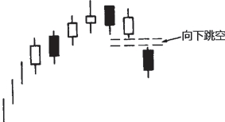

**在圆形顶部形态中**，市场逐步形成向上凸起的圆弧状图案，在这个过程中，通常出现的是一些较小的实体。最后，当市场向下跳空时，就证明圆形顶部形态已经完成。

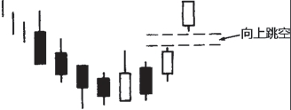

**圆形底部形态**反映出市场正处于底部反转过程中，市场逐步呈现出向下凹进的圆弧状图案，然后市场向上跳空（打开一个向上的窗口）。

## 塔形顶部形态和塔形底部形态
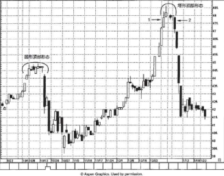

**塔形顶部形态**出现在高价格水平上。市场本来处在上升趋势中，在某一时刻，出现了一根坚挺的白色蜡烛线或者一系列白色蜡烛线，然后市场放缓了上涨的步调，接着出现了一根或者数根大的黑色蜡烛线，于是塔形顶部形态就完成了。在本形态中，中间有若干小实体，两侧长长的白色和黑色蜡烛线形如“高塔”。也就是一边由长蜡烛线组成下跌的一侧，另一边由长蜡烛线组成上涨的一侧。 

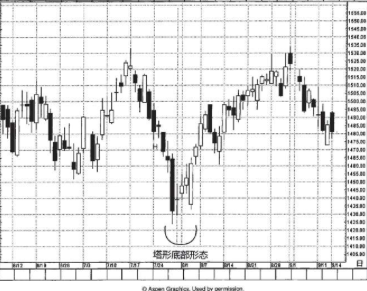

**塔形底部形态**发生在下降行情中。市场形成了一根或数根长长的黑色蜡烛线，表示空方动力丝毫不减。后来出现了几根小实体，缓和了行情看跌的气氛。最后出现了一根长长的白色蜡烛线，完成了一个塔形底部形态。

## 窗口
技术分析师一般把价格跳空称为**窗口**。组成窗口的蜡烛线必须是其影线之间互不重叠。**窗口属于持续性质的技术信号**。因此，如果出现了向上的窗口，我们就应该利用市场回落的机会逢低买进；如果出现了向下的窗口，就应该利用市场反弹的机会逢高卖出。

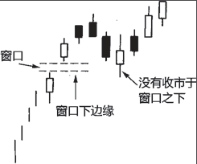

如果出现了**向上的窗口**，则在今后市场向下回撤时，这个窗口将形成支撑区域（这是指窗口的全部空间）。如果市场在向下回撤时收市价达到了窗口下边缘之下的水平，那么，先前的上升趋势就不复成立了。

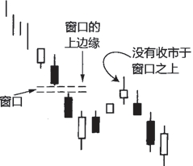

同样，如果出现了一个**向下的窗口**，则意味着市场还将进一步下降。此后形成的任何价格向上反弹，都会在这个窗口处遭遇阻挡（指窗口的全部空间）。如果多方拥有足够的推动力，将收市价推升到向下的窗口之上，那么，下降趋势就完结了。

在窗口幅度相对较大的情况下，请记住，向上的窗口的关键支撑水平位于窗口的底部（相应地，向下的窗口的关键阻挡水平位于窗口的顶部）。

## 上升三法和下降三法形态 
所谓三法形态，包括看涨的上升三（蜡烛线）法，以及看跌的下降三（蜡烛线）法。这两类形态均属于**持续形态**。也就是说，一旦看涨的上升三法形态完成后，之前的趋势应当恢复，行情继续走高。相应地，在看跌的下降三法形态完成后，之前的下降趋势继续有效。

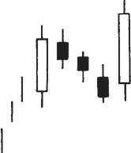

**上升三法**形态由以下几个方面组成： 
1. 首先出现的是一根长长的白色蜡烛线。 
2. 在这根白色蜡烛线之后，紧跟着一群依次下降的或者横向延伸的小实体蜡烛线。这群小实体蜡烛线的理想数目是3根，但是2根或者3根以上也是可以接受的，条件是：只要这群小实体蜡烛线基本上都局限在前面长长的白色蜡烛线的高点到低点的价格范围之内。
3. 最后一天应当是一根坚挺的白色实体蜡烛线，并且它的收市价高于第一天的收市价，同时其开市价应当高于前一天的收市价。 

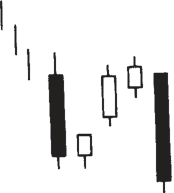

**下降三法**形态与上升三法形态完全是对等的，只不过方向相反。这类形态的形成过程如下：市场应当处在下降趋势中，首先出场的是一根长长的黑色蜡烛线。在这根黑色蜡烛线之后，跟随着大约3根依次上升的小蜡烛线，并且这群蜡烛线的实体都局限在第一根蜡烛线的范围之内（包括其上、下影线）。最后一天，开市价应低于前一天的收市价，并且收市价应低于第一根黑色蜡烛线的收市价。本形态与看跌旗形或看跌三角旗形形态相似。本形态的理想情形是，在第一根长实体之后，小实体的颜色与长实体相反。

## 分手线形态
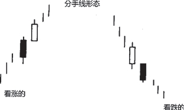

**分手线形态**也是由两根颜色相反的蜡烛线组成的，但是同**反击线形态**不同的是，分手线形态的两根蜡烛线具有相同的开市价。分手线形态属于**持续信号**。

## 十字线
**十字线**是一种独特的趋势转折信号，**特别是当它处在上涨行情时**。在十字线出现后，如果发生下列情形，则增加了十字线构成反转信号的可能性。 
1. 后续的蜡烛线验证了十字线的反转信号。 
2. 市场正处在超买状态或超卖状态。 
3. 十字线在该市场出现得不多。

在**长腿十字线上**（表示上影线和下影线都很长），十字的部分表示市场正处在过渡点上。长腿十字线是市场与之前趋势分道扬镳的标志。

**墓碑十字线**的长处在于昭示市场顶部方面。从墓碑十字线的外形看，它有着长长的上影线，它的名称是颇为贴切的。墓碑十字线标志着在市场上为捍卫自己的阵地而战死的多头的墓地。

**蜻蜓十字线**是墓碑十字线的反面角色，是看涨的。在蜻蜓十字线上，开市价和收市价位于本时段的最高点。这意味着，在本时段内市场曾经下跌至很低的水平，但后来力挽狂澜，收市价已经回升到或非常接近本时段的最高点。这一点与锤子线相像，但是锤子线是小实体，而蜻蜓十字线是一根十字线，没有实体。

## 三星形态
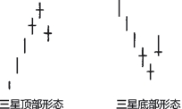

**三星形态**是非常罕见的反转形态。

理想的三星顶部形态由三根十字线组成，中间的十字线高于前一根和后一根十字线。

## 破低反涨形态与破高反跌形态
破高反跌形态与破低反涨形态的概念最初是根据理查德·威科夫（Richard Wyckoff）的有关思想发展起来的。

### 破低反涨形态
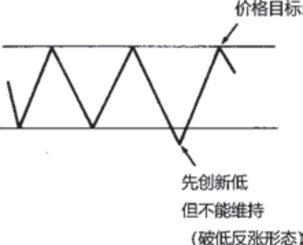

**破低反涨形态**发生在横向波动区间的支撑区域，起先市场向下突破了支撑区域，后来返回到曾经被跌破的支撑区域之上。换句话说，新低价格水平是不能维持的。一旦破低反涨形态形成，我们就能获得一个止损退出的区域，还有一个价格目标。如果某支撑区域最近被向下突破，但市场不能维持，很快回升到支撑区域之上，就可以考虑买进。如果市场坚挺，就不应当跌回最近的低点。最近的低点可以作为止损水平（最好以收市价为标准）。

### 破高反跌形态
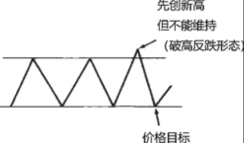

**破高反跌形态**发生在横向区间的阻挡水平，市场起先向上突破了阻挡水平，但是多方无力维持新高价位。这其实是假突破现象换了一种说法。为了利用破高反跌形态来交易，当市场从先前的阻挡水平之上回落到其下方时，可以考虑卖出。如果市场果真疲软，它就不应该再涨回到最近的高点。下方的价格目标是市场最近的新低，或者是横向交易区间的底边。

## 极性转换原则
过去的支撑水平演化为新的阻挡水平: 

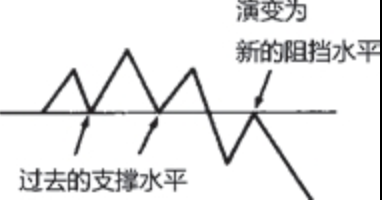

过去的阻挡水平演化为新的支撑水平:

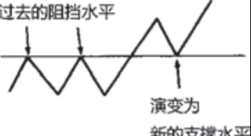

