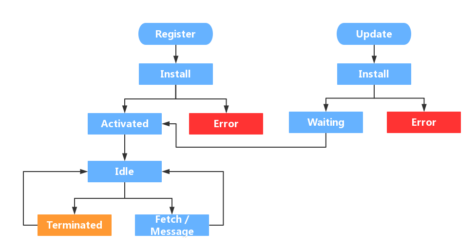

# Service Worker
Service Worker 支持一对多通信和离线，由于 Service Worker 的异步设计，localStorage 在 Service Worker 中不可用，因此数据持久化唯一的选择是 IndexedDB，IndexedDB 的兼容性和 Service Worker 基本一致。

## Service Worker 生命周期
Service Worker 的生命周期大概可以用如下图片解释：



### Register
要使用 Service Worker，首先需要注册一个 Service Worker，通知浏览器为该页面分配一块内存，然后 Service Worker 就会进入安装阶段。

Service Worker 线程在下载预存资源时，会占用部分主线程的带宽，对CPU和性能有一定的损耗，而且在刚打开页面时，很多资源都要加载，所以我们应该在页面加载完再注册 Service Worker。

Service Worker 的作用域决定了 Service Worker 可以监听和代理哪些请求，在该作用域以及其下级目录下发起的 fetch 请求都受当前的 Service Worker 控制，在作用域以外地址下发起的请求，Service Worker 是无法进行代理的。Service Worker 默认的作用域是当前 Service Worker 所在的目录，可以在注册的时候指定 Service Worker 的作用域，但是指定的作用域不能大于当前 Service Worker 所在的目录。

```js
if ('serviceWorker' in navigator) {
  window.addEventListener('load', () => {
    navigator.serviceWorker.register(`/sw.js${Date.now()}`, { scope: '/' })
      .then((registration) => {
        registration.onupdatefound = () => {
              const e = n.installing;
              e.onstatechange = function() {
                  switch (e.state) {
                      case 'installed':
                          navigator.serviceWorker.controller ? console.log('New or updated content is available.') : console.log('Content is now available offline!');
                          break;
                      case 'redundant':
                          console.error('ServiceWorker became redundant.')
                  }
              }
          }
      })
      .catch((err) => {
        console.log('ServiceWorker registration failed: ', err);
      });
  });   
}
```

### Install
注册后，浏览器就会开始安装 Service Worker，可以通过 install 事件监听，在此阶段可以缓存资源。

更换脚本后，新脚本会在后台安装，等待旧脚本不再被页面使用才会激活新脚本，刷新旧脚本依然会使用，只有完全退出，然后重新进入网站才会正式使用。可以使用 skipWaiting 跳过等待，并立马控制页面。

skipWaiting 意味着新 Service Worker 控制了之前用旧 Service Worker 获取的页面，也就是说你的页面有一部分资源是通过旧 Service Worker 获取，剩下一部分是通过新 Service Worker 获取的，这样可能会导致页面展示错误，因此，最好只在本地调试时使用该方法。

```js
var CACHE_PREFIX = 'sw-cache';
var CACHE_VERSION = '0.0.1';
var CACHE_NAME = CACHE_PREFIX+'-'+CACHE_VERSION;
var allAssets = [
    './main.css'
];
self.addEventListener('install', function(event) {
  //调试时跳过等待过程
  self.skipWaiting();
 
  //使用 event.waitUntil 可以延长一个事件作用的时间，比如我们使用 caches.open 是用来打开指定的缓存，但开启的时候，
  //并不是一下就能调用成功，也有可能有一定延迟，由于系统会随时睡眠 SW，所以，为了防止执行中断，
  //就需要使用 event.waitUntil 进行捕获。另外，event.waitUntil 会监听所有的异步 promise
  //如果其中一个 promise 是 reject 状态，那么该次 event 是失败的。这就导致，我们的 SW 开启失败。
  event.waitUntil(
    caches.open(CACHE_NAME)
      .then(function(cache) {
        console.log('[SW]: Opened cache');
        return cache.addAll(allAssets);
      })
  );
});
```

### Activated
如果是第一次加载 Service Worker，在安装后，会直接进入 activated 阶段，而如果 Service Worker 进行更新，情况就会显得复杂一些。更新流程是：首先老的 Service Worker 为 A，新的 Service Worker 版本为 B。B 进入 install 阶段，而 A 还处于工作状态，所以 B 进入waiting 阶段。只有等到 A 被 terminated 后，B 才能正常替换 A 的工作。

这个 terminated 的时机有如下几种方式：

关闭浏览器一段时间；
1. 手动清除 Service Worker；
2. 在 Service Worker 安装时直接跳过 waiting 阶段；
3. 初次激活后（包括第一次安装激活），当前作用域内的页面并未受控（意味着，fetch 拦截等都不生效），需要等到刷新或者使用 clients.claim() 来让页面立马受到控制

activated 阶段可以做很多有意义的事情，比如清除旧的缓存资源，如果不进行清除的话，缓存会越来越多，最后导致空间不足。

```js
self.addEventListener('activate', function(event) {
  event.waitUntil(
    caches.keys()
      .then(function (keys) {
        var all = keys.map(function (key) {
          if (key.indexOf(CACHE_PREFIX) !== -1 && key.indexOf(CACHE_VERSION) === -1){
            console.log('[SW]: Delete cache:' + key);
            return caches.delete(key);
          }
        });
        return Promise.all(all);
      }).then(function() {
        return self.clients.claim();
      })
  );
});
```

### Idle
这个空闲状态一般是不可见的，这种一般说明 Service Worker 的事情都处理完毕了，然后处于闲置状态了。

浏览器会周期性的轮询，去释放处于 idle 的 Service Worker 占用的资源。

### Fetch
fetch 阶段用于拦截代理所有指定的请求，并进行对应的操作，例如返回匹配到的缓存资源。

```js
// 监听浏览器的所有fetch请求，对已经缓存的资源使用本地缓存回复
self.addEventListener('fetch', function(event) {
  event.respondWith(
    caches.match(event.request)
      .then(function(response) {
        // 该fetch请求已经缓存
        if (response) {
          return response;
        }
        return fetch(event.request);
      })
  );
});
```

### Update
Service Worker 文件也会受 http 缓存策略控制，如果新的 worker 未被成功下载，或者解析错误，或者在运行时出错，或者在安装阶段不成功，新的 worker 会被丢弃，旧的会被保留，一旦新的 worker 被成功安装，更新的 worker 会进入等待状态，新的 worker 会等待旧的worker下线才会激活，新的 worker 和旧的会并存。

Service Worker 的更新策略有两种：
1. 在服务器端配置 Service Worker 的 header，Cache-control: no-cache，使其不被缓存；
2. 前端进行 Service Worker 的版本控制，每次注册都添加版本号进行改写，可以使用 sw-register-webpack-plugin 插件自动生成版本号；

## IndexDB

```js
// Define in db.js
class DB {
  constructor(
    name,
    version,
    { onupgradeneeded, onversionchange = this._onversionchange } = {}
  ) {
    this._name = name;
    this._version = version;
    this._onupgradeneeded = onupgradeneeded;
    this._onversionchange = onversionchange;

    this._db = null;
  }

  get db() {
    return this._db;
  }

  async open() {
    if (this._db) return;
    this._db = await new Promise((resolve, reject) => {
      let openRequestTimedOut = false;
      setTimeout(() => {
        openRequestTimedOut = true;
        reject(new Error("The open request was blocked and timed out"));
      }, this.OPEN_TIMEOUT);
      const openRequest = indexedDB.open(this._name, this._version);

      openRequest.onerror = () => reject(openRequest.error);

      openRequest.onupgradeneeded = (evt) => {
        if (openRequestTimedOut) {
          openRequest.transaction.abort();
          evt.target.result.close();
        } else if (this._onupgradeneeded) {
          this._onupgradeneeded(evt);
        }
      };

      openRequest.onsuccess = ({ target }) => {
        const db = target.result;

        if (openRequestTimedOut) {
          db.close();
        } else {
          db.onversionchange = this._onversionchange.bind(this);
          resolve(db);
        }
      };
    });
    return this;
  }

  async getAllMatching(
    storeName,
    { index, query = null, direction = "next", count, includeKeys } = {}
  ) {
    return await this.transaction([storeName], "readonly", (txn, done) => {
      const store = txn.objectStore(storeName);
      const target = index ? store.index(index) : store;
      const results = [];

      target.openCursor(query, direction).onsuccess = ({ target }) => {
        const cursor = target.result;

        if (cursor) {
          const { primaryKey, key, value } = cursor;
          results.push(
            includeKeys
              ? {
                  primaryKey,
                  key,
                  value,
                }
              : value
          );

          if (count && results.length >= count) {
            done(results);
          } else {
            cursor.continue();
          }
        } else {
          done(results);
        }
      };
    });
  }

  async transaction(storeNames, type, callback) {
    await this.open();
    return await new Promise((resolve, reject) => {
      const txn = this._db.transaction(storeNames, type);

      txn.onabort = ({ target }) => reject(target.error);

      txn.oncomplete = () => resolve();

      callback(txn, (value) => resolve(value));
    });
  }

  async _call(method, storeName, type, ...args) {
    const callback = (txn, done) => {
      txn.objectStore(storeName)[method](...args).onsuccess = ({ target }) => {
        done(target.result);
      };
    };

    return await this.transaction([storeName], type, callback);
  }

  _onversionchange() {
    this.close();
  }

  close() {
    if (this._db) {
      this._db.close();

      this._db = null;
    }
  }

  static async deleteDatabase(name) {
    await new Promise((resolve, reject) => {
      const request = indexedDB.deleteDatabase(name);

      request.onerror = ({ target }) => {
        reject(target.error);
      };

      request.onblocked = () => {
        reject(new Error("Delete blocked"));
      };

      request.onsuccess = () => {
        resolve();
      };
    });
  }
}

DB.prototype.OPEN_TIMEOUT = 2000;

(function () {
  const methodsToWrap = {
    readonly: ["get", "count", "getKey", "getAll", "getAllKeys"],
    readwrite: ["add", "put", "clear", "delete"],
  };

  for (const [mode, methods] of Object.entries(methodsToWrap)) {
    for (const method of methods) {
      if (method in IDBObjectStore.prototype) {
        DB.prototype[method] = async function (storeName, ...args) {
          return await this._call(method, storeName, mode, ...args);
        };
      }
    }
  }
})();

// Use in sw.js
importScripts('./db.js');

const TABLE_NAME = 'event-table';
const db = new DB('my-db', 1, {
  onupgradeneeded: function (e) {
    const db = e.target.result;
    const objStore = db.createObjectStore(TABLE_NAME, { keyPath: 'id' });

    objStore.createIndex('ctime', 'ctime', { unique: false });
    objStore.createIndex('flowId', 'flowId', { unique: false });
    objStore.createIndex('level', 'level', { unique: false });
    objStore.createIndex('name', 'name', { unique: false });
    objStore.createIndex('pageName', 'pageName', { unique: false });
    objStore.createIndex('pathname', 'pathname', { unique: false });
    objStore.createIndex('selector', 'selector', { unique: false });
    objStore.createIndex('tabNames', 'tabNames', { unique: false });
    objStore.createIndex('type', 'type', { unique: false });
  },
});

// 查找
const records = await db.getAllMatching(TABLE_NAME, {
  index: 'flowId',
  query: IDBKeyRange.only('abc'),
});

// 添加
const newRecord = { id: 'abc', flowId: '123' }
db.add(TABLE_NAME, newRecord);
```
