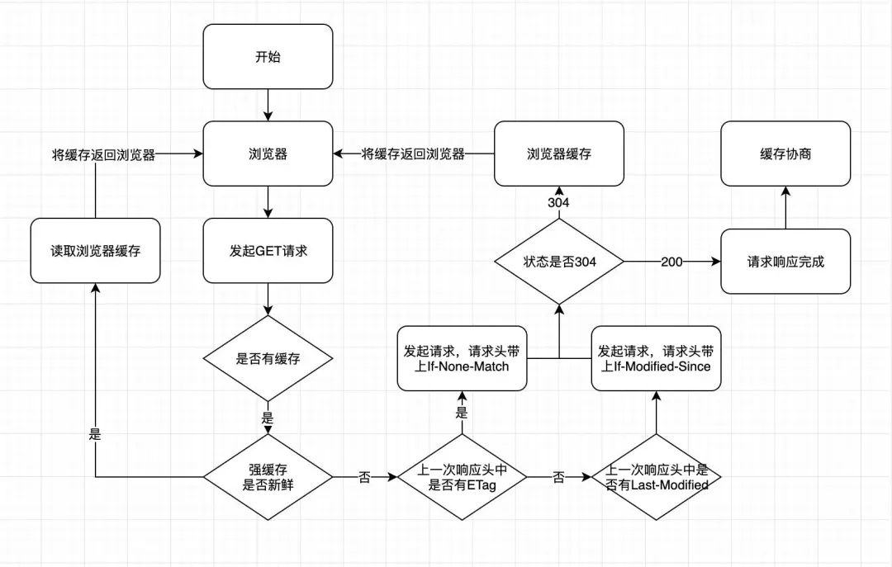

# 浏览器缓存

HTTP缓存分为2种，一种是强缓存，另一种是协商缓存。主要作用是可以加快资源获取速度，提升用户体验，减少网络传输，缓解服务端的压力。这是缓存运作的一个整体流程图：

## 强缓存
不需要发送请求到服务端，直接读取浏览器本地缓存，在 Chrome 的 Network 中显示的 HTTP 状态码是 200 ，在 Chrome 中，强缓存又分为 Disk Cache（存放在硬盘中）和 Memory Cache（存放在内存中），存放的位置是由浏览器控制的。是否强缓存由 Expires、Cache-Control 和 Pragma 3 个 Header 属性共同来控制。

### Expires
Expires 的值是一个HTTP日期，在浏览器发起请求时，会根据系统时间和 Expires 的值进行比较，如果系统时间超过了 Expires 的值，缓存失效。由于和系统时间进行比较，所以当系统时间和服务器时间不一致的时候，会有缓存有效期不准的问题。Expires 的优先级在三个 Header 属性中是最低的。

### Cache-Control
Cache-Control 是 HTTP/1.1 中新增的属性，在请求头和响应头中都可以使用，常用的属性值如有：
- **max-age**：单位是秒，缓存时间计算的方式是距离发起的时间的秒数，超过间隔的秒数缓存失效
- **no-cache**：不使用强缓存，需要与服务器验证缓存是否新鲜
- **no-store**：禁止使用缓存（包括协商缓存），每次都向服务器请求最新的资源
- **private**：专用于个人的缓存，中间代理、CDN 等不能缓存此响应
- **public**：响应可以被中间代理、CDN 等缓存
- **must-revalidate**：在缓存过期前可以使用，过期后必须向服务器验证

### Pragma
Pragma 只有一个属性值，就是 no-cache ，效果和 Cache-Control 中的 no-cache 一致，不使用强缓存，需要与服务器验证缓存是否新鲜，在 3 个头部属性中的优先级最高。

## 协商缓存
当浏览器的强缓存失效的时候或者请求头中设置了不走强缓存，并且在请求头中设置了If-Modified-Since 或者 If-None-Match 的时候，会将这两个属性值到服务端去验证是否命中协商缓存，如果命中了协商缓存，会返回 304 状态，加载浏览器缓存，并且响应头会设置 Last-Modified 或者 ETag 属性。

### ETag/If-None-Match
ETag/If-None-Match 的值是一串 hash 码，代表的是一个资源的标识符，当服务端的文件变化的时候，它的 hash码会随之改变，通过请求头中的 If-None-Match 和当前文件的 hash 值进行比较，如果相等则表示命中协商缓存。ETag 又有强弱校验之分，如果 hash 码是以 "W/" 开头的一串字符串，说明此时协商缓存的校验是弱校验的，只有服务器上的文件差异（根据 ETag 计算方式来决定）达到能够触发 hash 值后缀变化的时候，才会真正地请求资源，否则返回 304 并加载浏览器缓存。

### Last-Modified/If-Modified-Since
Last-Modified/If-Modified-Since 的值代表的是文件的最后修改时间，第一次请求服务端会把资源的最后修改时间放到 Last-Modified 响应头中，第二次发起请求的时候，请求头会带上上一次响应头中的 Last-Modified 的时间，并放到 If-Modified-Since 请求头属性中，服务端根据文件最后一次修改时间和 If-Modified-Since 的值进行比较，如果相等，返回 304 ，并加载浏览器缓存。

>ETag/If-None-Match 的出现主要解决了 Last-Modified/If-Modified-Since 所解决不了的问题：
>- 如果文件的修改频率在秒级以下，Last-Modified/If-Modified-Since 会错误地返回 304
>- 如果文件被修改了，但是内容没有任何变化的时候，Last-Modified/If-Modified-Since 会错误地返回 304，上面的例子就说明了这个问题

