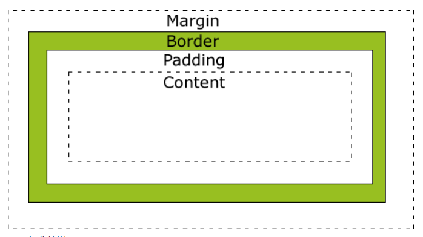
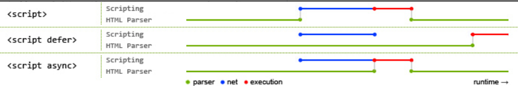

# 浏览器

## BFC
BFC 即 Block Formatting Contexts (块级格式化上下文)，它属于定位方案的普通流。
具有 BFC 特性的元素可以看作是隔离了的独立容器，容器里面的元素不会在布局上影响到外面的元素，并且 BFC 具有普通容器所没有的一些特性。

### 触发BFC
只要元素满足下面任一条件即可触发 BFC 特性：
- body 根元素
- 浮动元素：float 除 none 以外的值
- 绝对定位元素：position (absolute、fixed)
- display 为 inline-block、table-cells、flex
- overflow 除了 visible 以外的值 (hidden、auto、scroll)

### BFC 特性及应用
1. 同一个 BFC 下外边距会发生折叠
2. BFC 可以包含浮动的元素（清除浮动）
3. BFC 可以阻止元素被浮动元素覆盖

## 盒子模型
CSS盒模型本质上是一个盒子，封装周围的HTML元素，它包括：边距，边框，填充，和实际内容。
盒模型允许我们在其它元素和周围元素边框之间的空间放置元素。
下面的图片说明了盒子模型(Box Model)：

不同部分的说明：
- **Margin(外边距)** - 清除边框外的区域，外边距是透明的。
- **order(边框)** - 围绕在内边距和内容外的边框。
- **Padding(内边距)** - 清除内容周围的区域，内边距是透明的。
- **Content(内容)** - 盒子的内容，显示文本和图像。

### W3C盒子模型
标准盒模型下盒子的大小 = width ( content ) + border + padding + margin

### 怪异盒模型
怪异盒模型下盒子的大小=width（content + border + padding） + margin

## async 与 defer
当浏览器碰到 script 脚本的时候：
1. ``  
没有 defer 或 async，浏览器会立即加载并执行指定的脚本，“立即”指的是在渲染该 script 标签之下的文档元素之前，也就是说不等待后续载入的文档元素，读到就加载并执行。

2. ``  
有 async，加载和渲染后续文档元素的过程将和 script.js 的加载与执行并行进行（异步）。

3. ``  
有 defer，加载后续文档元素的过程将和 script.js 的加载并行进行（异步），但是 script.js 的执行要在所有元素解析完成之后，DOMContentLoaded 事件触发之前完成。

从实用角度来说呢，首先把所有脚本都丢到 `</body>` 之前是最佳实践，因为对于旧浏览器来说这是唯一的优化选择，此法可保证非脚本的其他一切元素能够以最快的速度得到加载和解析。

蓝色线代表网络读取，红色线代表执行时间，这俩都是针对脚本的；绿色线代表 HTML 解析。 
此图告诉我们以下几个要点：
1. defer 和 async 在网络读取（下载）这块儿是一样的，都是异步的（相较于 HTML 解析）
2. 它俩的差别在于脚本下载完之后何时执行，显然 defer 是最接近我们对于应用脚本加载和执行的要求的
3. 关于 defer，此图未尽之处在于它是按照加载顺序执行脚本的，这一点要善加利用
4. async 则是一个乱序执行的主，反正对它来说脚本的加载和执行是紧紧挨着的，所以不管你声明的顺序如何，只要它加载完了就会立刻执行
5. 仔细想想，async 对于应用脚本的用处不大，因为它完全不考虑依赖（哪怕是最低级的顺序执行），不过它对于那些可以不依赖任何脚本或不被任何脚本依赖的脚本来说却是非常合适的，最典型的例子：Google Analytics

## 浏览器的Cookie策略
浏览器所持有的Cookie分为两种：一种是“Session Cookie”，又称“临时Cookie”；另一种是“Third-party Cookie”，也称为“本地Cookie”。

两者的区别在于，Third-party Cookie是服务器在Set-Cookie时指定了Expire时间，只有到了Expire事件后Cookie才会失效，所以这种Cookie保存在本地；
而Session Cookie则没有指定Expire时间，所以浏览器关闭后，Session Cookie就失效了。

在浏览网站的过程中，若是一个网站设置了Session Cookie，那么在浏览器进程的生命周期内，即使浏览器
新打开了Tab页，Session Cookie也都是有效的。Session Cookie保存在浏览器进程的内存空间中；而Third-party Cookie则保存在本地。

## 跨域问题
协议、域名、端口有一项不同即构成跨域，二级域名不同也会构成跨域。
同源策略只是浏览器客户端的防护机制，当发现非同源HTTP请求时会拦截响应，但服务器依然处理了这个请求。

解决跨域有以下几种方式：
1. API跨域可以通过服务器上nginx反向代理。
2. 本地webpack dev server可以设置 proxy。
3. cors需要后台配合设置HTTP响应头，如果请求不是简单请求（1. method：get，post，2. content-type：三种表单自带的content-type，3. 没有自定义的HTTP header），
  浏览器会先发送option预检请求，后端需要响应option请求（返回204 no-content），然后浏览器才会发送正式请求，cors通过白名单的形式允许指定的域发送请求。
4. jsonp是浏览器会放过 img script标签引入资源的方式。所以可以通过后端返回一段执行js函数的脚本，将数据作为参数传入。然后在前端执行这段脚本。双方约定一个函数的名称。
  资源请求是get类型，请求参数长度有限制，也不能进行post请求。

::: warning 
new Image, 设src 的时候，图片需要设置Cors
:::

