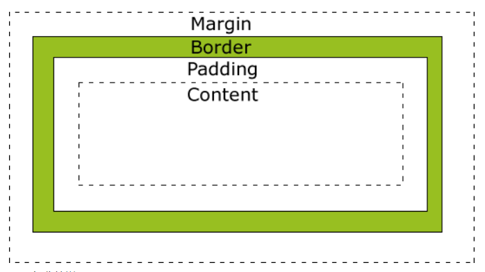

# CSS

## 盒子模型
CSS盒模型本质上是一个盒子，封装周围的HTML元素，它包括：边距，边框，填充，和实际内容。
盒模型允许我们在其它元素和周围元素边框之间的空间放置元素。
下面的图片说明了盒子模型(Box Model)：


不同部分的说明：
- **Margin(外边距)** - 清除边框外的区域，外边距是透明的。
- **order(边框)** - 围绕在内边距和内容外的边框。
- **Padding(内边距)** - 清除内容周围的区域，内边距是透明的。
- **Content(内容)** - 盒子的内容，显示文本和图像。

### W3C盒子模型
标准盒模型下盒子的大小 = width ( content ) + border + padding + margin

### 怪异盒模型
怪异盒模型下盒子的大小=width（content + border + padding） + margin

## BFC
BFC 即 Block Formatting Contexts (块级格式化上下文)，它属于定位方案的普通流。
具有 BFC 特性的元素可以看作是隔离了的独立容器，容器里面的元素不会在布局上影响到外面的元素，并且 BFC 具有普通容器所没有的一些特性。

### 触发BFC
只要元素满足下面任一条件即可触发 BFC 特性：
- body 根元素
- 浮动元素：float 除 none 以外的值
- 绝对定位元素：position (absolute、fixed)
- display 为 inline-block、table-cells、flex
- overflow 除了 visible 以外的值 (hidden、auto、scroll)

### BFC 特性及应用
1. 同一个 BFC 下外边距会发生折叠
2. BFC 可以包含浮动的元素（清除浮动）
3. BFC 可以阻止元素被浮动元素覆盖

## CSS的优先级
[优先级](https://www.w3.org/TR/selectors-3/#specificity)就是分配给指定的 CSS 声明的一个权重，它由匹配的选择器中的每一种选择器类型的数值决定。
而当优先级与多个 CSS 声明中任意一个声明的优先级相等的时候，CSS 中最后的那个声明将会被应用到元素上。
当同一个元素有多个声明的时候，优先级才会有意义。因为每一个直接作用于元素的 CSS 规则总是会接管/覆盖（take over）该元素从祖先元素继承而来的规则。

权重得分计算规则：
1. 通用选择器(*)没有特异性，只能得到0点
2. 元素或伪元素选择器获得1个点
3. 类、伪类或属性选择器获得10个点
4. ID 选择器获得100个点
5. 内联样式属性获得1000个点
6. !important获得10000个点

::: warning
`:not()`本身不会影响优先级计算，但它括号里面添加的选择器会影响优先级。

```css
div:not(.my-class) {
  color: red;
}
```

这个例子得到11点，因为它有一个类型选择器(div)和一个类在:not()中
:::

## viewport
视口( viewport)代表当前可见的计算机图形区域。在 Web浏览器术语中，通常与浏览器窗口相同，但不包括浏览器的 UI， 菜单栏等——即指你正在浏览的文档的那一部分。

一般我们所说的视口共包括三种：布局视口、视觉视口和理想视口，它们在屏幕适配中起着非常重要的作用。
- **布局视口( layout viewport)**：当我们以百分比来指定一个元素的大小时，它的计算值是由这个元素的包含块计算而来的。当这个元素是最顶级的元素时，它就是基于布局视口来计算的。
  所以，布局视口是网页布局的基准窗口，在 PC浏览器上，布局视口就等于当前浏览器的窗口大小（不包括 borders 、 margins、滚动条）。
  在移动端，布局视口被赋予一个默认值，大部分为 980px，这保证 PC的网页可以在手机浏览器上呈现，但是非常小，用户可以手动对网页进行放大。
  我们可以通过调用 `document.documentElement.clientWidth/clientHeight`来获取布局视口大小。
- **视觉视口( visual viewport)**：用户通过屏幕真实看到的区域。视觉视口默认等于当前浏览器的窗口大小（包括滚动条宽度）。
  当用户对浏览器进行缩放时，不会改变布局视口的大小，所以页面布局是不变的，但是缩放会改变视觉视口的大小。
  例如：用户将浏览器窗口放大了 200%，这时浏览器窗口中的 CSS像素会随着视觉视口的放大而放大，这时一个 CSS像素会跨越更多的物理像素。
  所以，布局视口会限制你的 CSS布局而视觉视口决定用户具体能看到什么。我们可以通过调用 `window.innerWidth/innerHeight`来获取视觉视口大小。  
- **理想视口( ideal viewport)**：布局视口在移动端展示的效果并不是一个理想的效果，所以理想视口就诞生了：网站页面在移动端展示的理想大小。
  在浏览器调试移动端时页面上给定的像素大小就是理想视口大小，它的单位正是设备独立像素。
  上面在介绍 CSS像素时曾经提到 `页面的缩放系数=CSS像素/设备独立像素`，实际上说 `页面的缩放系数=理想视口宽度/视觉视口宽度`更为准确。
  所以，当页面缩放比例为 100%时， CSS像素=设备独立像素， 理想视口=视觉视口。
  我们可以通过调用 `screen.width/height`来获取理想视口大小。

### Meta viewport
`<meta>`元素表示那些不能由其它 HTML元相关元素之一表示的任何元数据信息，它可以告诉浏览器如何解析页面。
我们可以借助 <meta>元素的 viewport来帮助我们设置视口、缩放等，从而让移动端得到更好的展示效果。
```html
<meta name="viewport" content="width=device-width; initial-scale=1; maximum-scale=1; minimum-scale=1; user-scalable=no;">
```

为了在移动端让页面获得更好的显示效果，我们必须让布局视口、视觉视口都尽可能等于理想视口。
`device-width`就等于理想视口的宽度，所以设置 `width=device-width`就相当于让布局视口等于理想视口。
由于 `initial-scale=理想视口宽度/视觉视口宽度`，所以我们设置 `initial-scale=1`;就相当于让视觉视口等于理想视口。
这时，1个 CSS像素就等于1个设备独立像素，而且我们也是基于理想视口来进行布局的，所以呈现出来的页面布局在各种设备上都能大致相似。

上面提到 `width`可以决定布局视口的宽度，实际上它并不是布局视口的唯一决定性因素，设置 `initial-scale`也有肯能影响到布局视口，因为布局视口宽度取的是**width和视觉视口宽度的最大值**。
例如：若手机的理想视口宽度为 400px，设置 `width=device-width`， `initial-scale=2`，此时 `视觉视口宽度=理想视口宽度/initial-scale`即 200px，布局视口取两者最大值即 device-width 400px。
若设置 width=device-width， initial-scale=0.5，此时 视觉视口宽度=理想视口宽度/initial-scale即 800px，布局视口取两者最大值即 800px。

### 一些术语
- **英寸**: 一般用英寸描述屏幕的物理大小(屏幕对角线的长度)，英寸(`inch`,缩写为 `in`)在荷兰语中的本意是大拇指，一英寸就是指甲底部普通人拇指的宽度。`1英寸=2.54厘米`
- **像素**: 像素即一个小方块，它具有特定的位置和颜色。
- **屏幕分辨率**: 指一个屏幕具体由多少个像素点组成。

### PPI
PPI(Pixel Per Inch)：每英寸包括的像素数。PPI可以用于描述屏幕的清晰度以及一张图片的质量。<br>
计算公式：sqrt(水平像素点数^2+垂直像素点数^2)/尺寸

### DPI
DPI(Dot Per Inch)：即每英寸包括的点数。
这里的点是一个抽象的单位，它可以是屏幕像素点、图片像素点也可以是打印机的墨点。
平时你可能会看到使用 DPI来描述图片和屏幕，这时的 DPI应该和 PPI是等价的， DPI最常用的是用于描述打印机，表示打印机每英寸可以打印的点数。

### DIP
设备独立像素( Device Independent Pixels)简称 DIP或 DP。在实际开发中使用的CSS中的像素就是设备独立像素中的一种，CSS像素的单位为px。
这个单位是用来同时告诉不同分辨率的手机，它们在界面上显示元素的大小是多少。
例如黑色手机使用了视网膜屏幕的技术，假如列表的宽度为 300个像素，那么在一条水平线上，
白色手机会用 300个物理像素去渲染它，而黑色手机实际上会用 600个物理像素去渲染它。

### DPR
设备像素比 device pixel ratio简称 dpr，即物理像素和设备独立像素的比值。
在 web中，浏览器为我们提供了`window.devicePixelRatio`来帮助我们获取 dpr。
在 css中，可以使用媒体查询`min-device-pixel-ratio`，区分 dpr：
```css
@media(-webkit-min-device-pixel-ratio:2),(min-device-pixel-ratio:2){
}
```

>在写 CSS时，我们用到最多的单位是 px，即 CSS像素，当页面缩放比例为 100%时，一个 CSS像素等于一个设备独立像素。
但是 CSS像素是很容易被改变的，当用户对浏览器进行了放大， CSS像素会被放大，这时一个 CSS像素会跨越更多的物理像素。
页面的缩放系数=CSS像素/设备独立像素。

### 获取浏览器大小
- **window.innerHeight**：获取浏览器视觉视口高度（包括垂直滚动条）。
- **window.outerHeight**：获取浏览器窗口外部的高度。表示整个浏览器窗口的高度，包括侧边栏、窗口镶边和调正窗口大小的边框。
- **window.screen.Height**：获取获屏幕取理想视口高度，这个数值是固定的， 设备的分辨率/设备像素比
- **window.screen.availHeight**：浏览器窗口可用的高度。
- **document.documentElement.clientHeight**：获取浏览器布局视口高度，包括内边距，但不包括垂直滚动条、边框和外边距。
- **document.documentElement.offsetHeight**：包括内边距、滚动条、边框和外边距。
- **document.documentElement.scrollHeight**：在不使用滚动条的情况下适合视口中的所有内容所需的最小宽度。测量方式与 clientHeight相同：它包含元素的内边距，但不包括边框，外边距或垂直滚动条。

### 获取元素大小
- **clientHeight**：包括padding但不包括border、水平滚动条、margin的元素的高度。对于inline的元素这个属性一直是0，单位px，只读元素。
- **offsetHeight**：包括padding、border、水平滚动条，但不包括margin的元素的高度。对于inline的元素这个属性一直是0，单位px，只读元素。
- **scrollHeight**：包括当前不可见部分的元素的高度。而可见部分的高度其实就是clientHeight
- **scrollTop**：代表在有滚动条时，滚动条向下滚动的距离也就是元素顶部被遮住部分的高度。
- **offsetTop**：当前元素顶部距离最近父元素顶部的距离,和有没有滚动条没有关系。单位px，只读元素。

::: warning offsetHeight与style.height区别
1. offsetHeight可以获取写在样式文件里的属性值，而style.height只能获取行内属性，在表现与结构分离的今天，这显然是不合适的
2. offsetHeight返回的是一个数值，而style.height返回的是一个字符串，单位是“px”
3. offsetHeight是只读，而style.height是可读写
4. 如果没有为元素设置高度，offsetHeight会根据内容获取高度值，而style.height会返回undefind
:::

## 移动端适配方案

### 1.flexible方案
flexible方案是阿里早期开源的一个移动端适配解决方案，引用 flexible后，我们在页面上统一使用`rem`来布局。
`rem`是相对于`html`节点的`font-size`来做计算的。

将 `html`节点的 `font-size`设置为页面 `clientWidth`(布局视口)的 1/10，即 1rem就等于页面布局视口的 1/10，
这就意味着我们后面使用的 rem都是按照页面比例来计算的。

以 iPhone6为例：布局视口为 375px，则 `1rem=37.5px`，这时 UI给定一个元素的宽为 75px（设备独立像素），我们只需要将它设置为 `75/37.5=2rem`。

当然，每个布局都要计算非常繁琐，我们可以借助 `PostCSS`的 `px2rem`插件来帮助我们完成这个过程。

::: warning lexible方案的缺陷
1. lib-flexible在适配的时候会修改viewport的initial-scale，导致viewport的width不等于device-width，导致媒介查询不可用。
2. lib-flexible现在只适配了iphone设备，安卓设备压根没适配。
:::

### vh、vw方案
vh、vw方案即将视觉视口宽度 window.innerWidth和视觉视口高度 window.innerHeight 等分为 100 份。

如果视觉视口为 `375px`，那么 `1vw=3.75px`，这时 UI给定一个元素的宽为 `75px`（设备独立像素），我们只需要将它设置为 `75/3.75=20vw`。

这里的比例关系我们也不用自己换算，我们可以使用 `PostCSS`的 `postcss-px-to-viewport` 插件帮我们完成这个过程。写代码时，我们只需要根据 UI给的设计图写 px单位即可。

当然，没有一种方案是十全十美的， vw同样有一定的缺陷：
- px转换成 vw不一定能完全整除，因此有一定的像素差。
- 比如当容器使用 vw， margin采用 px时，很容易造成整体宽度超过 100vw，从而影响布局效果。当然我们也是可以避免的，例如使用 padding代替 margin，结合 calc()函数使用等等...

## 图片模糊问题
我们平时使用的图片大多数都属于位图（ png、jpg...），位图由一个个像素点构成的，每个像素都具有特定的位置和颜色值。
理论上，位图的每个像素对应在屏幕上使用一个物理像素来渲染，才能达到最佳的显示效果。
而在 dpr>1的屏幕上，位图的一个像素可能由多个物理像素来渲染，然而这些物理像素点并不能被准确的分配上对应位图像素的颜色，只能取近似值，所以相同的图片在 dpr>1的屏幕上就会模糊。

**解决方案**：
1. 使用`media`查询判断不同的设备像素比来显示不同精度的图片
2. 使用 `img`标签的 `srcset`属性，浏览器会自动根据像素密度匹配最佳显示图片
