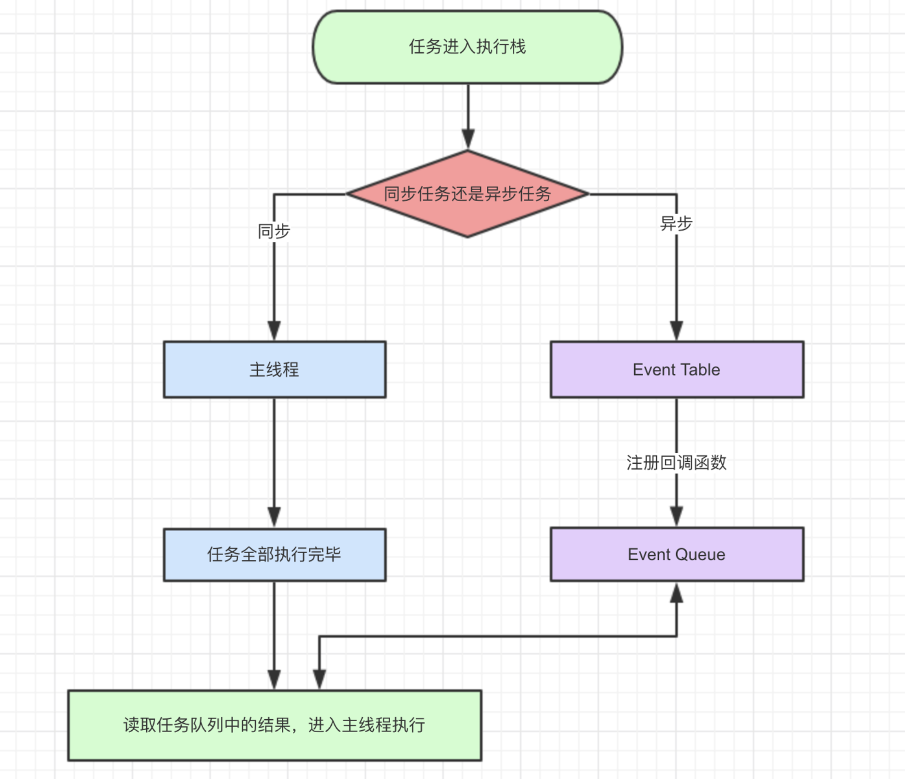

# Event Loop
javascript是一门单线程语言，虽然HTML5提出了Web-works这样的多线程解决方案，但是并没有改变JaveScript是单线程的本质。
>什么是H5 Web Works？<br>
>就是将一些大计算量的代码交由web Worker运行而不冻结用户界面，但是子线程完全受主线程控制，且不得操作DOM。所以，这个新标准并没有改变JavaScript单线程的本质

既然js是单线程的，就是同一时间只能做一件事情。那么问题来了，我们访问一个页面，这个页面的初始化代码运行时间很长，比如有很多图片、视频、外部资源等等，难道我们也要一直在那等着吗？答案当然是: "不能"。

所以就出现了两类任务：
- 同步任务
- 异步任务
  

1. 同步和异步任务分别进入不同的 '‘场所'’ 执行。所有同步任务都在主线程上执行，形成一个执行栈；而异步任务进入`Event Table`并注册回调函数
2. 当这个异步任务有了运行结果，`Event Table`会将这个回调函数移入`Event Queue`，进入等待状态
3. 当主线程内同步任务执行完成，会去`Event Queue`读取对应的函数，并结束它的等待状态，进入主线程执行
4. 主线程不断重复上面3个步骤，也就是常说的`Event Loop`(事件循环)。

>那么我们怎么知道什么时候主线程是空的呢？<br>
>js引擎存在monitoring process进程，会持续不断的检查主线程执行栈是否为空，一旦为空，就会去Event Queue那里检查是否有等待被调用的函数。

除了广义的同步任务和异步任务，我们对任务有更精细的定义：
- **macro-task(宏任务)**：包括整体代码script、setTimeout、setInterval、I/O、UI交互事件，可以理解是每次执行栈执行的代码就是一个宏任务；
- **micro-task(微任务)**：Promise，process.nextTick，且process.nextTick优先级大于promise.then。可以理解是在当前 task 执行结束后立即执行的任务

## 流程
1. 从任务队列中取出一个宏任务并执行。
2. 检查微任务队列，执行并清空微任务队列，如果在微任务的执行中又加入了新的微任务，也会在这一步一起执行。
3. 进入更新渲染阶段，判断是否需要渲染，这里有一个 `rendering opportunity` 的概念，也就是说不一定每一轮 `event loop` 都会对应一次浏览器渲染，
要根据屏幕刷新率、页面性能、页面是否在后台运行来共同决定，通常来说这个渲染间隔是固定的。（所以多个 task 很可能在一次渲染之间执行）
    - 浏览器会尽可能的保持帧率稳定，例如页面性能无法维持 60fps（每 16.66ms 渲染一次）的话，那么浏览器就会选择 30fps 的更新速率，而不是偶尔丢帧。
    - 如果浏览器上下文不可见，那么页面会降低到 4fps 左右甚至更低。
    - 如果满足以下条件，也会跳过渲染：<br>
        a. 浏览器判断更新渲染不会带来视觉上的改变。<br>
        b. map of animation frame callbacks 为空，也就是帧动画回调为空，可以通过 `requestAnimationFrame` 来请求帧动画。
4. 如果上述的判断决定本轮不需要渲染，那么下面的几步也不会继续运行：
5. 对于需要渲染的文档，如果窗口的大小发生了变化，执行监听的 `resize` 方法。
6. 对于需要渲染的文档，如果页面发生了滚动，执行 scroll 方法。
7. 对于需要渲染的文档，执行帧动画回调，也就是 `requestAnimationFrame` 的回调。
8. 对于需要渲染的文档， 执行 `IntersectionObserver` 的回调。
9. 对于需要渲染的文档，重新渲染绘制用户界面。
10. 判断 task队列和microTask队列是否都为空，如果是的话，则进行 Idle 空闲周期的算法，判断是否要执行 `requestIdleCallback` 的回调函数。

对于resize 和 scroll来说，并不是到了这一步才去执行滚动和缩放，那岂不是要延迟很多？浏览器当然会立刻帮你滚动视图，
根据[CSSOM 规范](https://drafts.csswg.org/cssom-view/#scrolling-events)所讲，
浏览器会保存一个 `pending scroll event targets`，等到事件循环中的 scroll 这一步，去派发一个事件到对应的目标上，驱动它去执行监听的回调函数而已。resize也是同理。

## 实例
下面开始分析以下的代码
```js
console.log('1');
async function async1() {
    console.log('2');
    await async2();
    console.log('3');
}
async function async2() {
    console.log('4');
}

process.nextTick(function() {
    console.log('5');
})

setTimeout(function() {
    console.log('6');
    process.nextTick(function() {
        console.log('7');
    })
    new Promise(function(resolve) {
        console.log('8');
        resolve();
    }).then(function() {
        console.log('9')
    })
})

async1();

new Promise(function(resolve) {
    console.log('10');
    resolve();
}).then(function() {
    console.log('11');
});
console.log('12');
```

第一轮事件循环流程：
- 整体script作为第一个宏任务进入主线程，遇到console.log，输出1
- 遇到async1、async2函数声明，声明暂时不用管
- 遇到process.nextTick()，其回调函数被分发到微任务Event Queue中。我们记为process1
- 遇到setTimeout，其回调函数被分发到宏任务Event Queue中。我们暂且记为setTimeout1
- 执行async1，遇到console.log，输出2
- 遇到await async2()调用，发现async2也是一个 async 定义的函数，所有直接执行输出4，同时返回了一个Promise。我们记为await1。await会让出线程，接下来就会跳出async1函数继续往下执行。
- 遇到Promise，new Promise直接执行，输出10。then被分发到微任务Event Queue中。我们记为then1
- 遇到console.log，输出12

| 宏任务Event Queue | 微任务Event Queue |
| :--------------- | :--------------- |
| setTimeout1      | process1         |
|                  | await1           | 
|                  | then1            | 

上表是第一轮事件循环宏任务结束时各Event Queue的情况，此时已经输出了1 2 4 10 12

我们发现了process1、await1 和then1三个微任务
- 执行process1,输出5。
- 取到 await1 ，输出3。
- 执行then1，输出11。

| 宏任务Event Queue | 微任务Event Queue |
| :--------------- | :--------------- |
| setTimeout1      |                  | 

到这里，第一轮事件循环结束，此时，输出顺序是 1 2 4 10 12 5 3 11

第二轮时间循环从setTimeout1宏任务开始
- 遇到console.log，输出6
- 遇到process.nextTick()，同样将其分发到微任务Event Queue中，记为process2
- 遇到new Promise立即执行输出8，then也分发到微任务Event Queue中，记为then2

| 宏任务Event Queue | 微任务Event Queue |
| :--------------- | :--------------- |
|                  | process2         |
|                  | then2            | 

上表是第二轮事件循环宏任务结束时各Event Queue的情况，我们发现了process2和then2两个微任务

执行process2,输出7
执行then2，输出9
第二轮事件循环结束，第二轮输出6 8 7 9

整段代码，共进行了两次事件循环，完整的输出 1 2 4 10 12 5 3 11 6 8 7 9

## 参考
- [深入解析 EventLoop 和浏览器渲染、帧动画、空闲回调的关系](https://mp.weixin.qq.com/s/l9pGe7-xY08DeaFMnk0xuA)

