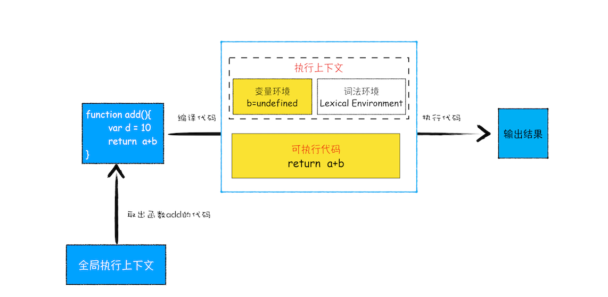
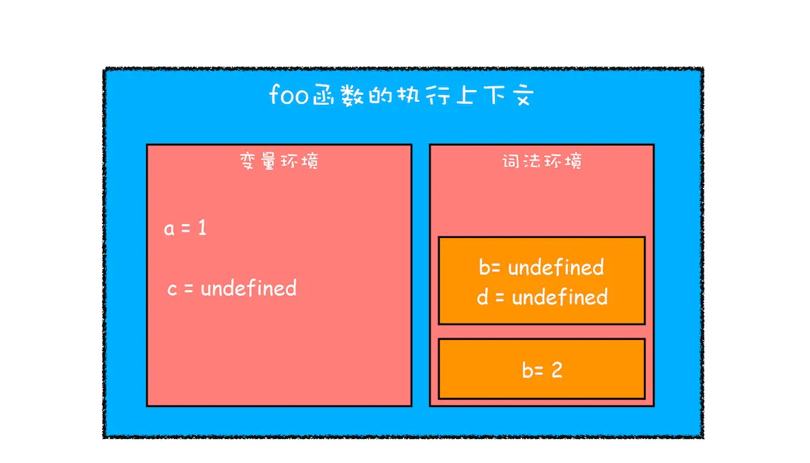
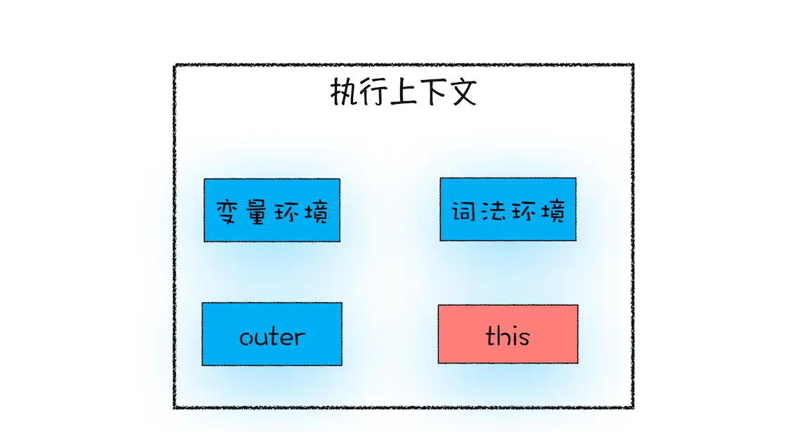
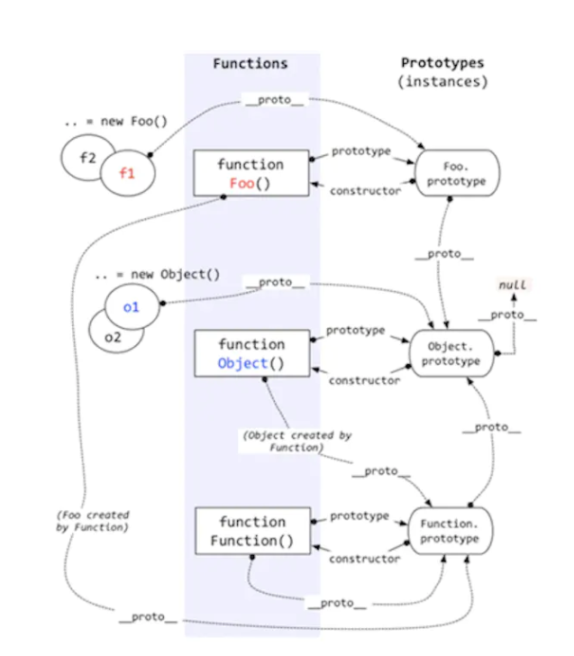

# Javascript


## 数据类型
| 类型       | 描述          | 
| :-------- | :------------ | 
| Boolean   | 只有true和false两个值 | 
| Null      | 只有一个值null  | 
| Undefined | 一个没有被赋值的变量会有个默认值undefined, 变量提升时的默认值也是undefined | 
| Number    | 根据ECMAScript标准，Javascript中只有一种数字类型：基于IEEE 754标准的双精度64位二进制格式的值，-(263-1) 到 (263-1) | 
| BigInt    | Javascript中的一个新的数字类型，可以用任意精度表示整数。使用BigInt，即使超出 Number 的安全整数范围限制，也可以安全地存储操作。 | 
| String    | 用于表示文本数据。不同于C语言，Javascript的字符串是不可更改的。 |
| Symbol    | 符号类型是唯一的并且是不可修改的，通常用来作为Object的key。 | 
| Object    | 在Javascript里，对象可以被看作是一组属性的集合。 |

**使用 typeof 检测 Null 类型时，返回的是 Object。这是当初 JavaScript 语言的一个 Bug，一直保留至今，之所以一直没修改过来，主要是为了兼容老的代码。**

**在 JavaScript 中，赋值操作和其他语言有很大的不同，原始类型的赋值会完整复制变量值，而引用类型的赋值是复制引用地址。**


## 变量提升
所谓的变量提升，是指在 JavaScript 代码执行过程中，JavaScript 引擎把变量的声明部分和函数的声明部分提升到代码开头的“行为”。
变量被提升后，会给变量设置默认值，这个默认值就是我们熟悉的 undefined。

- JavaScript 代码执行过程中，需要先做**变量提升**，而之所以需要实现变量提升，是因为 JavaScript 代码在执行之前需要先编译。
- 在**编译阶段**，变量和函数会被存放到**变量环境**中，变量的默认值会被设置为 undefined；在代码**执行阶段**，JavaScript 引擎会从变量环境中去查找自定义的变量和函数。
- 如果在编译阶段，存在两个相同的函数，那么最终存放在变量环境中的是最后定义的那个，这是因为后定义的会覆盖掉之前定义的。
- **函数提升要比变量提升的优先级要高，且不会被变量声明覆盖，但是会被变量赋值之后覆盖**。

### 变量提升带来的问题
1. 变量容易在不被察觉的情况下被覆盖掉
2. 本应销毁的变量没有被销毁

```js
showName()
var showName = function() {
    console.log(2)
}
function showName() {
    console.log(1)
}
showName()
// 输出 1 2

function foo(){ 
    for (var i = 0; i < 7; i++) { } 
    console.log(i); 
}
foo()
// 输出 7
```

## 函数调用



- 每调用一个函数，JavaScript 引擎会为其创建**执行上下文**，并把该执行上下文压入调用栈，然后 JavaScript 引擎开始执行函数代码。
- 如果在一个函数 A 中调用了另外一个函数 B，那么 JavaScript 引擎会为 B 函数创建执行上下文，并将 B 函数的执行上下文压入栈顶。
- 当前函数执行完毕后，JavaScript 引擎会将该函数的执行上下文弹出栈。
- 当分配的调用栈空间被占满时，会引发“堆栈溢出”问题。

## 作用域
作用域是指在程序中定义变量的区域，该位置决定了变量的生命周期。通俗地理解，作用域就是变量与函数的可访问范围，即作用域控制着变量和函数的可见性和生命周期。

- **全局作用域**中的对象在代码中的任何地方都能访问，其生命周期伴随着页面的生命周期。
- **函数作用域**就是在函数内部定义的变量或者函数，并且定义的变量或者函数只能在函数内部被访问。函数执行结束之后，函数内部定义的变量会被销毁。
- ES6 引入了 **let** 和 **const** 关键字，从而使 JavaScript 也能像其他语言一样拥有了**块级作用域**。

### 块级作用域的原理


- 函数内部通过 var 声明的变量，在编译阶段全都被存放到**变量环境**里面了。
- 通过 let 声明的变量，在编译阶段会被存放到**词法环境**（Lexical Environment）中。
- 在函数的作用域块内部，通过 let 声明的变量并没有被存放到词法环境中。

当进入函数的作用域块时，作用域块中通过 let 声明的变量，会被存放在词法环境的一个单独的区域中，这个区域中的变量并不影响作用域块外面的变量，
比如在作用域外面声明了变量 b，在该作用域块内部也声明了变量 b，当执行到作用域内部时，它们都是独立的存在。

其实，在词法环境内部，维护了一个小型栈结构，栈底是函数最外层的变量，进入一个作用域块后，就会把该作用域块内部的变量压到栈顶；当作用域执行完成之后，该作用域的信息就会从栈顶弹出，这就是词法环境的结构。

变量的具体查找方式是：沿着词法环境的栈顶向下查询，如果在词法环境中的某个块中查找到了，就直接返回给 JavaScript 引擎，如果没有查找到，那么继续在变量环境中查找。


::: warning 暂时性死区
通过let或者const声明的变量会在进入块级作用域的时被创建，但是在该变量没有赋值之前，引用该变量JavaScript引擎会抛出错误---这就是“暂时性死区”。
:::
  
```js
let myName = 'a';
function show() {
    console.log(myName);
    let myName = 'b';
}
show();
// VM328:3 Uncaught ReferenceError: Cannot access 'myName' before initialization
```

## 栈空间和堆空间
在 JavaScript 的执行过程中， 主要有三种类型内存空间，分别是**代码空间**、**栈空间**和**堆空间**。

**栈空间**就是函数调用产生的调用栈，是用来存储执行上下文的。

**原始类型的数据值都是直接保存在“栈”中的，引用类型的值是存放在“堆”中的**。这是因为 JavaScript 引擎需要用栈来维护程序执行期间上下文的状态，如果栈空间大了话，所有的数据都存放在栈空间里面，那么会影响到上下文切换的效率，进而又影响到整个程序的执行效率。

## 闭包
在 JavaScript 中，根据词法作用域的规则，内部函数总是可以访问其外部函数中声明的变量，当通过调用一个外部函数返回一个内部函数后，即使该外部函数已经执行结束了，但是内部函数引用外部函数的变量依然保存在内存中，我们就把这些变量的集合称为闭包。比如外部函数是 foo，那么这些变量的集合就称为 foo 函数的闭包。

JavaScript 引擎会在**堆空间**创建换一个“closure(**)”的对象（这是一个内部对象，JavaScript 是无法访问的），用来保存这些变量。

## this
在对象内部的方法中使用对象内部的属性是一个非常普遍的需求。但是 JavaScript 的作用域机制并不支持这一点，基于这个需求，JavaScript 又搞出来另外一套 this 机制。


从图中可以看出，**this 是和执行上下文绑定的**，也就是说每个执行上下文中都有一个 this。执行上下文主要分为三种——全局执行上下文、函数执行上下文和 eval 执行上下文，所以对应的 this 也只有这三种——全局执行上下文中的 this、函数中的 this 和 eval 中的 this。

### 默认绑定
- **独立函数调用**，可以把默认绑定看作是无法应用其他规则时的默认规则，this指向全局对象。
- **严格模式**下，不能将全局对象用于默认绑定，this会绑定到undefined。只有函数运行在非严格模式下，默认绑定才能绑定到全局对象。在严格模式下调用函数则不影响默认绑定。
```js
function foo() { // 运行在严格模式下，this会绑定到undefined
    "use strict";
    
    console.log(this.a);
}
var a = 2;
// 调用
foo(); // TypeError: Cannot read property 'a' of undefined

function foo() { // 运行
    console.log( this.a );
}

var a = 2;

(function() { // 严格模式下调用函数则不影响默认绑定
    "use strict";
    
    foo(); // 2
})();
```

### 隐式绑定
当函数引用有上下文对象时，隐式绑定规则会把函数中的this绑定到这个上下文对象。对象属性引用链中只有上一层或者说最后一层在调用中起作用。
```js
function foo() {
    console.log( this.a );
}

var obj = {
    a: 2,
    foo: foo
};

obj.foo(); // 2
```

**隐式丢失** 被隐式绑定的函数特定情况下会丢失绑定对象，应用默认绑定，把this绑定到全局对象或者undefined上。
```js
// 虽然bar是obj.foo的一个引用，但是实际上，它引用的是foo函数本身。
// bar()是一个不带任何修饰的函数调用，应用默认绑定。
function foo() {
    console.log( this.a );
}

var obj = {
    a: 2,
    foo: foo
};

var bar = obj.foo; // 函数别名
var a = "oops, global"; // a是全局对象的属性
bar(); // "oops, global"
```

参数传递就是一种隐式赋值，传入函数时也会被隐式赋值。回调函数丢失this绑定是非常常见的。
```js
function foo() {
    console.log( this.a );
}

function doFoo(fn) {
    // fn其实引用的是foo
    
    fn(); // <-- 调用位置！
}

var obj = {
    a: 2,
    foo: foo
};

var a = "oops, global"; // a是全局对象的属性
doFoo( obj.foo ); // "oops, global"
```

### 显式绑定
通过call(..) 或者 apply(..)方法。第一个参数是一个对象，在调用函数时将这个对象绑定到this。因为直接指定this的绑定对象，称之为显示绑定。
::: warning
显示绑定无法解决丢失绑定问题。bind函数可以解决这个问题
:::

### new 绑定
在JS中，构造函数只是使用new操作符时被调用的普通函数，他们不属于某个类，也不会实例化一个类。
包括内置对象函数（比如Number(..)）在内的所有函数都可以用new来调用，这种函数调用被称为构造函数调用。
实际上并不存在所谓的“构造函数”，只有对于函数的“构造调用”。<br>

使用new来调用函数，或者说发生构造函数调用时，会自动执行下面的操作。
1. 创建（或者说构造）一个新对象。
2. 这个新对象会被执行**Prototype**连接。
3. 这个新对象会绑定到函数调用的this。
4. 如果函数没有返回其他对象，那么new表达式中的函数调用会自动返回这个新对象。

::: tip 箭头函数
箭头函数是根据外层（函数或者全局）作用域（词法作用域）来决定this。<br>
对于箭头函数的this总结如下：
1. 箭头函数不绑定this，箭头函数中的this相当于普通变量。
2. 箭头函数的this寻值行为与普通变量相同，在作用域中逐级寻找。
3. 箭头函数的this无法通过bind，call，apply来直接修改（可以间接修改）。
4. 改变作用域中this的指向可以改变箭头函数的this。
5. eg. `function closure(){()=>{//code }}`，在此例中，我们通过改变封包环境`closure.bind(another)()`，来改变箭头函数this的指向。
:::

::: warning this 的设计缺陷以及应对方案
**嵌套函数中的 this 不会从外层函数中继承**。要解决这个问题，你可以有两种思路：
- 第一种是把 this 保存为一个 self 变量，再利用变量的作用域机制传递给嵌套函数。
- 第二种是继续使用 this，但是要把嵌套函数改为箭头函数，因为箭头函数没有自己的执行上下文，所以它会继承调用函数中的 this。
:::

## 原型
[参考](https://juejin.cn/post/6844903613584654344)


每个对象拥有一个原型对象，对象以其原型为模板，从原型继承方法和属性，这些属性和方法定义在对象的构造器函数的 prototype 属性上，而非对象实例本身。


### 原型链
每个对象拥有一个原型对象，通过 __proto__ 指针指向上一个原型 ，并从中继承方法和属性，同时原型对象也可能拥有原型，这样一层一层，
最终指向 null。这种关系被称为原型链 (prototype chain)，通过原型链一个对象会拥有定义在其他对象中的属性和方法。


## 严格模式
严格模式主要有以下限制：
- 变量必须声明后再使用
- 函数的参数不能有同名属性，否则报错
- 不能使用with语句
- 不能对只读属性赋值，否则报错
- 不能使用前缀 0 表示八进制数，否则报错
- 不能删除不可删除的属性，否则报错
- 不能删除变量delete prop，会报错，只能删除属性delete global[prop]
- eval不会在它的外层作用域引入变量
- eval和arguments不能被重新赋值
- arguments不会自动反映函数参数的变化
- 不能使用arguments.callee
- 不能使用arguments.caller
- 禁止this指向全局对象
- 不能使用fn.caller和fn.arguments获取函数调用的堆栈
- 增加了保留字（比如protected、static和interface）

## 模块化
**AMD 与 CMD**：

- AMD是 RequireJS 在推广过程中对模块定义的规范化产出。
- CMD是 SeaJS 在推广过程中对模块定义的规范化产出。
- CMD推崇依赖就近，AMD推崇依赖前置。


**ES Module与CommonJS**:

- CommonJS模块是对象，是运行时加载，运行时才把模块挂载在exports之上（加载整个模块的所有），加载模块其实就是查找对象属性。
- ES Module不是对象，是使用export显性指定输出，再通过import输入。此法为编译时加载，编译时遇到import就会生成一个只读引用。
  等到运行时就会根据此引用去被加载的模块取值。所以不会加载模块所有方法，仅取所需。
- CommonJS 模块输出的是一个值的拷贝，ES6 模块输出的是值的引用。
- CommonJS 模块是运行时加载，ES6 模块是编译时输出接口


**CommonJS与AMD/CMD**:

- AMD/CMD是CommonJS在浏览器端的解决方案。
- CommonJS是同步加载（代码在本地，加载时间基本等于硬盘读取时间）。
- AMD/CMD是异步加载（浏览器必须这么做，代码在服务端）


**UMD与AMD/CMD**:

- UMD（Universal Module Definition）是AMD和CommonJS的糅合，跨平台的解决方案。
- AMD模块以浏览器第一的原则发展，异步加载模块。
- CommonJS模块以服务器第一原则发展，选择同步加载，它的模块无需包装(unwrapped modules)。
- UMD先判断是否支持Node.js的模块（exports）是否存在，存在则使用Node.js模块模式。再判断是否支持AMD（define是否存在），存在则使用AMD方式加载模块。

### 参考
- [AMD, CMD, CommonJS，ES Module，UMD](https://juejin.cn/post/6844903663404580878)
- [图说 ES Modules](https://segmentfault.com/a/1190000014318751)
  