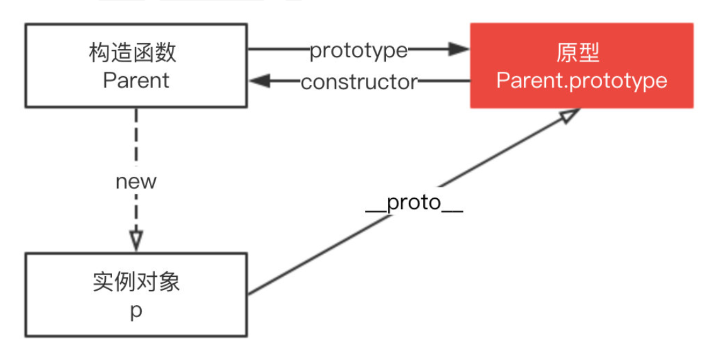
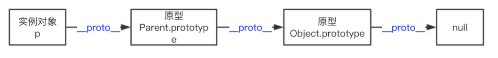

# Javascript

## 原型
每个对象拥有一个原型对象，对象以其原型为模板，从原型继承方法和属性，这些属性和方法定义在对象的构造器函数的 prototype 属性上，而非对象实例本身。


### 原型链
每个对象拥有一个原型对象，通过 __proto__ 指针指向上一个原型 ，并从中继承方法和属性，同时原型对象也可能拥有原型，这样一层一层，
最终指向 null。这种关系被称为原型链 (prototype chain)，通过原型链一个对象会拥有定义在其他对象中的属性和方法。


## this 解析

### 默认绑定
- **独立函数调用**，可以把默认绑定看作是无法应用其他规则时的默认规则，this指向全局对象。
- **严格模式**下，不能将全局对象用于默认绑定，this会绑定到undefined。只有函数运行在非严格模式下，默认绑定才能绑定到全局对象。在严格模式下调用函数则不影响默认绑定。
```js
function foo() { // 运行在严格模式下，this会绑定到undefined
    "use strict";
    
    console.log(this.a);
}
var a = 2;
// 调用
foo(); // TypeError: Cannot read property 'a' of undefined

function foo() { // 运行
    console.log( this.a );
}

var a = 2;

(function() { // 严格模式下调用函数则不影响默认绑定
    "use strict";
    
    foo(); // 2
})();
```

### 隐式绑定
当函数引用有上下文对象时，隐式绑定规则会把函数中的this绑定到这个上下文对象。对象属性引用链中只有上一层或者说最后一层在调用中起作用。
```js
function foo() {
    console.log( this.a );
}

var obj = {
    a: 2,
    foo: foo
};

obj.foo(); // 2
```

**隐式丢失** 被隐式绑定的函数特定情况下会丢失绑定对象，应用默认绑定，把this绑定到全局对象或者undefined上。
```js
// 虽然bar是obj.foo的一个引用，但是实际上，它引用的是foo函数本身。
// bar()是一个不带任何修饰的函数调用，应用默认绑定。
function foo() {
    console.log( this.a );
}

var obj = {
    a: 2,
    foo: foo
};

var bar = obj.foo; // 函数别名
var a = "oops, global"; // a是全局对象的属性
bar(); // "oops, global"
```

参数传递就是一种隐式赋值，传入函数时也会被隐式赋值。回调函数丢失this绑定是非常常见的。
```js
function foo() {
    console.log( this.a );
}

function doFoo(fn) {
    // fn其实引用的是foo
    
    fn(); // <-- 调用位置！
}

var obj = {
    a: 2,
    foo: foo
};

var a = "oops, global"; // a是全局对象的属性
doFoo( obj.foo ); // "oops, global"
```

### 显式绑定
通过call(..) 或者 apply(..)方法。第一个参数是一个对象，在调用函数时将这个对象绑定到this。因为直接指定this的绑定对象，称之为显示绑定。
::: warning
显示绑定无法解决丢失绑定问题。bind函数可以解决这个问题
:::

### new 绑定
在JS中，构造函数只是使用new操作符时被调用的普通函数，他们不属于某个类，也不会实例化一个类。
包括内置对象函数（比如Number(..)）在内的所有函数都可以用new来调用，这种函数调用被称为构造函数调用。
实际上并不存在所谓的“构造函数”，只有对于函数的“构造调用”。<br>

使用new来调用函数，或者说发生构造函数调用时，会自动执行下面的操作。
1. 创建（或者说构造）一个新对象。
2. 这个新对象会被执行**Prototype**连接。
3. 这个新对象会绑定到函数调用的this。
4. 如果函数没有返回其他对象，那么new表达式中的函数调用会自动返回这个新对象。

## 闭包
闭包是指有权访问另外一个函数作用域中的变量的函数。关键在于下面两点：
- 是一个函数
- 能访问另外一个函数作用域中的变量

对于闭包有下面三个特性：
1. 闭包可以访问当前函数以外的变量
2. 即使外部函数已经返回，闭包仍能访问外部函数定义的变量
3. 闭包可以更新外部变量的值

## let 与 const

### let
1. `var`命令会发生“变量提升”现象，即变量可以在声明之前使用，值为`undefined`。为了纠正这种现象，`let`命令改变了语法行为，它所声明的变量一定要在声明后使用，否则报错。  
2. 暂时性死区: 只要块级作用域内存在let命令，它所声明的变量就“绑定”（binding）这个区域，不再受外部的影响。
```js
var tmp = 123;

if (true) {
  tmp = 'abc'; // ReferenceError
  let tmp;
}
```
3. `let`不允许在相同作用域内，重复声明同一个变量。
4. `let`实际上为 JavaScript 新增了块级作用域。

### const
1. `const`声明一个只读的常量。一旦声明，常量的值就不能改变。
2. 其它点和`let`一致

## 严格模式
严格模式主要有以下限制：
- 变量必须声明后再使用
- 函数的参数不能有同名属性，否则报错
- 不能使用with语句
- 不能对只读属性赋值，否则报错
- 不能使用前缀 0 表示八进制数，否则报错
- 不能删除不可删除的属性，否则报错
- 不能删除变量delete prop，会报错，只能删除属性delete global[prop]
- eval不会在它的外层作用域引入变量
- eval和arguments不能被重新赋值
- arguments不会自动反映函数参数的变化
- 不能使用arguments.callee
- 不能使用arguments.caller
- 禁止this指向全局对象
- 不能使用fn.caller和fn.arguments获取函数调用的堆栈
- 增加了保留字（比如protected、static和interface）

## 模块化
**AMD 与 CMD**：

- AMD是 RequireJS 在推广过程中对模块定义的规范化产出。
- CMD是 SeaJS 在推广过程中对模块定义的规范化产出。
- CMD推崇依赖就近，AMD推崇依赖前置。


**ES Module与CommonJS**:

- CommonJS模块是对象，是运行时加载，运行时才把模块挂载在exports之上（加载整个模块的所有），加载模块其实就是查找对象属性。
- ES Module不是对象，是使用export显性指定输出，再通过import输入。此法为编译时加载，编译时遇到import就会生成一个只读引用。
  等到运行时就会根据此引用去被加载的模块取值。所以不会加载模块所有方法，仅取所需。
- CommonJS 模块输出的是一个值的拷贝，ES6 模块输出的是值的引用。
- CommonJS 模块是运行时加载，ES6 模块是编译时输出接口


**CommonJS与AMD/CMD**:

- AMD/CMD是CommonJS在浏览器端的解决方案。
- CommonJS是同步加载（代码在本地，加载时间基本等于硬盘读取时间）。
- AMD/CMD是异步加载（浏览器必须这么做，代码在服务端）


**UMD与AMD/CMD**:

- UMD（Universal Module Definition）是AMD和CommonJS的糅合，跨平台的解决方案。
- AMD模块以浏览器第一的原则发展，异步加载模块。
- CommonJS模块以服务器第一原则发展，选择同步加载，它的模块无需包装(unwrapped modules)。
- UMD先判断是否支持Node.js的模块（exports）是否存在，存在则使用Node.js模块模式。再判断是否支持AMD（define是否存在），存在则使用AMD方式加载模块。

[更多](https://juejin.cn/post/6844903663404580878)
