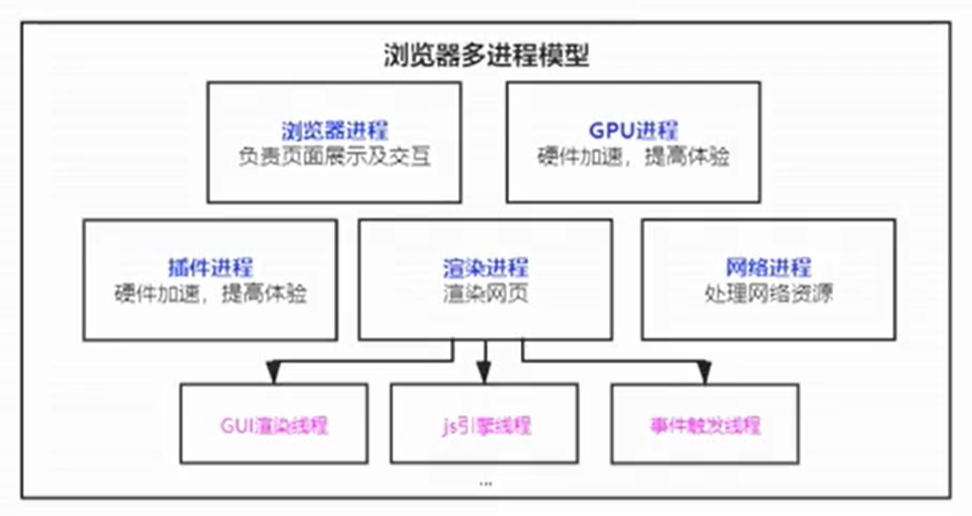
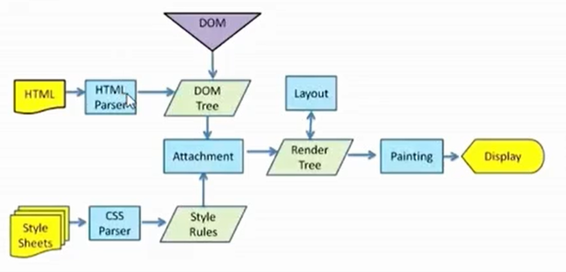

# 浏览器性能优化

## 浏览器多进程模型

- **浏览器进程**：负责界面显示、用户交互、子进程管理，提供存储等。
- **渲染进程**：每个页卡都有单独的渲染进程，核心用于渲染页面。
- **网络进程**：主要处理网络资源加载（html、css、js等）
- **GPU进程**：3d绘制，提高性能
- **插件进程**：chrome中安装的一些插件

## url请求过程

1. 用户输入url地址，浏览器开始导航
2. 浏览器会准备一个渲染进程用于渲染页面
3. 网络进程加载资源，最终将加载的资源交给渲染进程来处理
4. 渲染完毕显示，进程使用ipc进行通信

- 先去查找缓存，检测缓存是否过期，不过期直接返回缓存内容
- 看域名是否被解析过，NDS协议将域名解析成ip地址(DNS基于UDP)
- 请求是HTTPS，要经过SSL协商
- ip地址来进行寻址，排队等待，最多能发送6个http请求
- tcp创建连接，用于传输（三次握手）
- 利用tcp传输数据(拆分成数据包，可靠有序)，服务器会按照顺序来接受
- http请求 (请求行、请求头、请求体)
- 默认不会断开keep-alive，为了下次传输数据时，可以复用上次的创建的连接
- 服务器收到数据后（响应行、响应头、响应体）
- 服务器返回301、302会进行重定向操作
- 服务器返回304去查询浏览器缓存进行返回
  
## HTTP发展历程
1. http 0.9 负责传输html，最早的时候没有请求头和响应头
2. http 1.0 提供了http的header，根据header的不同来处理不同的资源
3. http 1.1 默认开启了keep-alive连接复用，管线化支持同一域名最多6个请求
4. http 2.0 一个域名一个tcp链接来发送数据（多路复用）,头部压缩，服务器可以推送数据给客户端
5. http 3.0 解决了tcp的对头阻塞问题 QUIC协议 采用了udp

## 渲染流程

1. 浏览器无法直接使用HTML，需要将HTML转化成DOM树。（document）
2. 浏览器无法解析纯文本的css样式，需要对css进行解析，解析成stylesheets。（document.styleSheets）
3. 计算出DOM树中每个节点的具体样式（Attachment）
4. 创建渲染（布局）树，将DOM树中可见节点，添加到布局树中。并计算节点渲染到页面的坐标位置。（layout）
5. 通过布局树，进行分层（根据定位属性、透明属性、transform属性、clip属性等）生成图层树
6. 将不同图层进行绘制，转交给合成线程处理。最终生产页面，并显示到浏览器上（Painting Display）