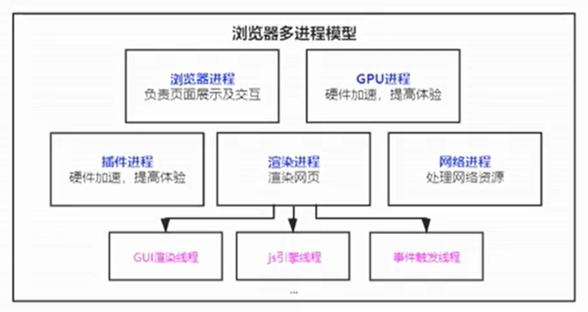
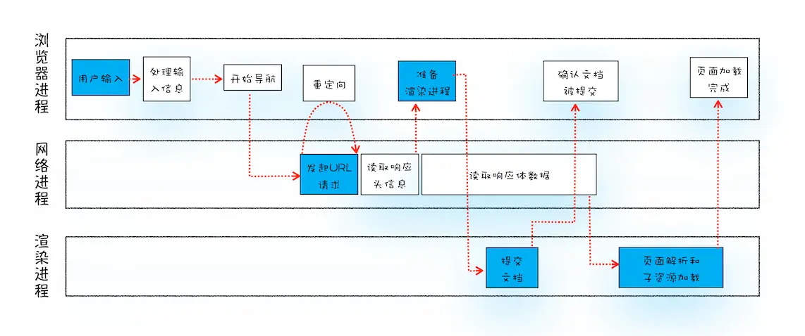
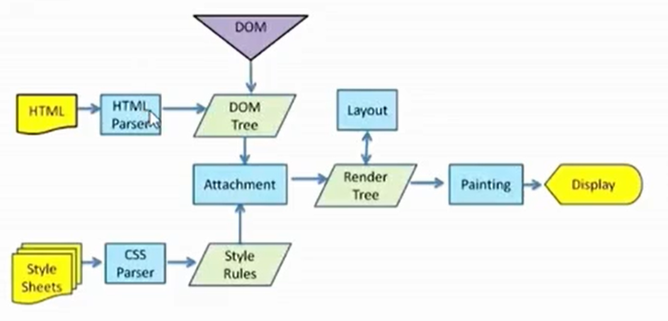
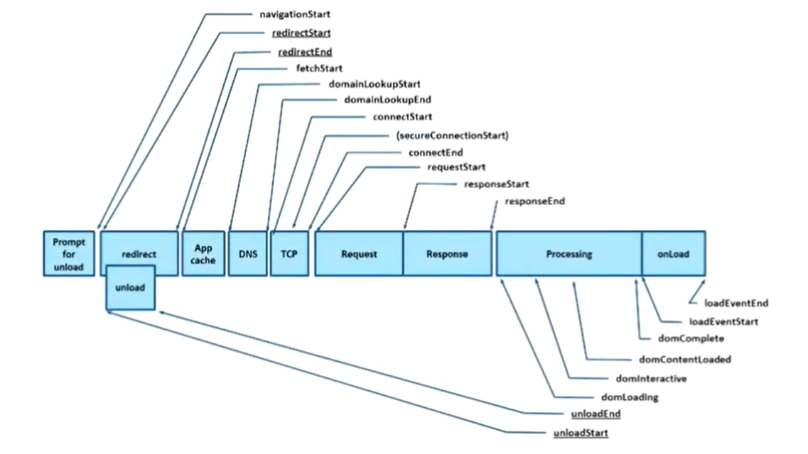

# 浏览器性能优化

## 浏览器多进程模型


- **浏览器进程**：负责界面显示、用户交互、子进程管理，提供存储等。
- **渲染进程**：每个页卡都有单独的渲染进程，核心用于渲染页面，排版引擎 Blink 和 Javascript 引擎 V8 都是运行在该进程中。
    出于安全考虑，渲染进程都是运行在沙箱模式下。
- **网络进程**：主要处理网络资源加载（html、css、js等）。
- **GPU进程**：3d绘制，提高性能。
- **插件进程**：主要负责插件的运行。

::: warning 同一站点（same-site)
我们将根域名和协议都相同的站点成为“同一站点”，Chrome 的默认策略是，每个标签对应一个渲染进程。但如果从一个页面打开了另一个新页面，
而新页面和当前页面属于同一站点的话，那么新页面会复用父页面的渲染进程。官方把这个默认策略叫 process-per-site-instance。
:::

## url请求过程


1. 用户输入内容并回车, 如果是搜索内容，就将搜索内容+默认搜索引擎合成新的URL； 如果是url就触发当前页面 `beforeunload` 事件, 可通过该事件取消导航
2. 浏览器导航栏显示loading状态, 浏览器进程组装协议，构成完整的url，http默认80，https默认443
3. 浏览器进程通过进程间通信（IPC）把url请求发送给网络进程
4. 网络进程接收到url请求后检查本地缓存是否缓存了该请求资源，如果有则将该资源返回给浏览器进程(状态码200 from disk 或 from memory cache)
5. 如果没有，网络进程向web服务器发起http请求（如果是https请求，还需要建立TLS连接），请求流程如下:<br>
  5.1 进行DNS解析，NDS协议将域名解析成ip地址(DNS基于UDP)，DNS可缓存<br>
  5.2 利用ip地址和服务器建立tcp连接(三次握手)，TCP头部——包括源端口号、目的程序端口号和用于校验数据完整性的序号，同一域名会有6个tcp连接限制(http/1.1)<br>
  5.3 连接建立之后，构建请求行、请求头等信息，并把和该域名相关的 Cookie 等数据附加到请求头中，然后向服务器发送构建的请求信息(GET /index.html HTTP1.1)。
      请求数据顺着应用层——传输层——网络层——网络层——传输层——应用层到达服务器。<br>
  5.4 服务器响应后，响应数据又顺着应用层——传输层——网络层——网络层——传输层——应用层的顺序返回到网络进程，网络进程接收响应头和响应信息，并解析响应内容
6. 网络进程解析响应流程：<br>
  6.1 检查状态码，如果是301/302，则需要重定向，从Location自动中读取地址，重新进行第4步；301 是永久重定向 第一次跳转后，浏览器会自己缓存 ，下次再访问老的地址就是走的是浏览器的缓存不会发请求
      302 是临时重定向 所以浏览器不会自作主张，每次都会向服务端询问<br>
  6.2 如果是304去查询浏览器缓存进行返回<br>
  6.2 如果是200，检查响应类型Content-Type，如果是字节流类型，则将该请求提交给下载管理器，该导航流程结束，不再进行
      后续的渲染，如果是html则通知浏览器进程准备渲染进程准备进行渲染。
7. 准备渲染流程：浏览器进程检查当前url是否和之前打开的渲染进程是否是同一站点，如果相同，则复用原来的进程，如果不同，则开启新的渲染进程 
8. 提交文档：浏览器进程将网络进程接收到的 HTML 数据提交给渲染进程<br>
   8.1 渲染进程接收到“提交文档”的消息后，会和网络进程建立传输数据的“管道”；<br>
   8.2 等文档数据传输完成之后，渲染进程会返回“确认提交”的消息给浏览器进程；<br>
   8.3 浏览器进程在收到“确认提交”的消息后，会更新浏览器界面状态，包括了安全状态、地址栏的 URL、前进后退的历史状态，并更新 Web 页面。
9. 接下来就是渲染流程了

## 渲染流程

1. 渲染进程将 HTML 内容转换为浏览器能够读懂的 DOM 树结构(document）。
2. 渲染引擎将 CSS 样式表转化为浏览器可以理解的 styleSheets(document.styleSheets)，计算出 DOM 节点的样式(Attachment）。
3. 创建布局树(Layout)，将DOM树中可见节点，添加到布局树中, 并计算节点渲染到页面的坐标位置。
4. 对布局树进行分层，并生成图层树（LayerTree）。通常满足下面两点中任意一点的元素就可以被提升为单独的一个图层：<br>
  4.1 拥有层叠上下文属性的元素会被提升为单独的一层;<br>
  4.2 需要剪裁（clip）的地方也会被创建为图层; 如文字溢出，渲染引擎会为文字部分单独创建一个层，如果出现滚动条，滚动条也会被提升为单独的层。
5. 为每个图层生成绘制列表，并将其提交到合成线程。
6. 合成线程将图层分成图块，并在光栅化线程池中将图块转换成位图。
7. 合成线程发送绘制图块命令 DrawQuad 给浏览器进程。
8. 浏览器进程根据 DrawQuad 消息生成页面，并显示到显示器上。

::: warning
Javascript脚本会阻塞DOM的解析，CSS则不会
:::


::: tip
**重排**：添加元素、删除元素、修改大小、移动元素位置、获取位置相关信息<br>
**重绘**：页面中元素样式的改变并不影响它在文档流中的位置<br>
**合成**：使用 CSS 的 transform 来实现动画效果，可以避开重排和重绘阶段，直接在非主线程上执行合成动画操作。
:::

## RAIL模型分析性能
- **Response**: 事件处理最好在50ms内完成
- **Animation**: 在10ms内产生一帧
- **Idle**: 最大化空闲时间
- **Load**: 传输内容到页面可交互的时间不超过5秒

## 性能指标


### TTFB
time to first byte，翻译为首字节时间，是指从请求到数据返回第一个字节所消耗的时间。

**统计逻辑**
```js
function getTTFB() {
  const {
    requestStart,
    responseStart
  } = performance.timing;

  return responseStart - requestStart;
}
```

### FP
FP，全称 First Paint，翻译为首次绘制,是时间线上的第一个时间点，它代表网页的第一个像素渲染到屏幕上所用时间，也就是页面在屏幕上首次发生视觉变化的时间。

**统计逻辑**
```JS
function getFPTime(){
    const timings = performance.getEntriesByType('paint')[0];
    return timings ? Math.round(timings.startTime) : null
}
```

### FCP
FCP，全称 First Contentful Paint，翻译为首次内容绘制，顾名思义，它代表浏览器第一次向屏幕绘内容。

注意：只有首次绘制文本、图片（包含背景图）、非白色的canvas或SVG时才被算作FCP。

**统计逻辑**
通过performance.getEntriesByType('paint’)，取第二个pain的时间，或者通过Mutation Observer观察到首次节点变动的时间。如：
```JS
const domEntries = []
const observer = new MutationObserver((mutationsList)=>{
    for(var mutation of mutationsList) {
        if (mutation.type == 'childList') {
            console.log('A child node has been added or removed.');
        }
        if (mutation.type == 'addedNodes') {
            //TODO新增了节点，做处理，计算此时的可见性/位置/出现时间等信息，然后 push 进数组
            ...
            domEntries.push(mutation)
        }
    }
});

function getFPTime(){
    const timings = performance.getEntriesByType('paint');
    if(timings.length > 1)return timings[1]
    return timings ? Math.round(timings.startTime) : null
    //伪代码,算 DOM 变化时的最小那个时间，即节点首次变动的时间
    return Math.round(domEntries.length ? Math.min(...domEntries.map(entry => entry.time)) : 0);
}
```

::: warning FP与FCP区别
FP是当浏览器开始绘制内容到屏幕上的时候，只要在视觉上开始发生变化，无论是什么内容触发的视觉变化，在这一刻，这个时间点，叫做FP。
相比之下，FCP指的是浏览器首次绘制来自DOM的内容。例如：文本，图片，SVG，canvas元素等，这个时间点叫FCP。
FP和FCP可能是相同的时间，也可能是先FP后FCP。
:::

### FMP
FMP，全称 First Meaningful Paint，翻译为首次有意义的绘制，是页面主要内容出现在屏幕上的时间, 这是用户感知加载体验的主要指标。
目前尚无标准化的定义, 因为很难以通用的方式去确定各种类型页面的关键内容。

**统计逻辑**
```js
new PerformanceObserver((entryList, observer) => {
  entryList.getEntries()[0];

  observer.disconnect();
}).observe({entryTypes: ['element']})
```

### DCL
Dom Content Loaded，整个dom加载完毕
**统计逻辑**
```js
const {
    fetchStart, // 开始访问
    domContentLoadedEventEnd, // dom加载完毕 + domcontentloaded完成的事件的事件 $(function(){})
} = performance.timing;
let DCL = domContentLoadedEventEnd - fetchStart; // DOM 整个加载完毕
```

### LCP
Largest Contentful Paint，翻译为最大内容渲染，在viewport中最大的页面元素加载的时间。

**统计逻辑**
```js
new PerformanceObserver((entryList, observer) => {
  const entries = entryList.getEntries();
  console.log(entries[entries.length-1]);

  observer.disconnect();
}).observe({entryTypes: ['largest-contentful-paint']})
```

### FID
FID，全称 First Input Delay，翻译为首次输入延迟，是测量用户首次与您的站点交互时的时间
（即当他们单击链接/点击按钮/使用自定义的JavaScript驱动控件时）到浏览器实际能够回应这种互动的时间。

**统计逻辑**
- 方式一，通过`performanceObserver`(目前支持性为88.78%)观察类型为`first-input`的entry，获得其startTime/duration等数即可
- 方式二，初始化时为特定事件类型(click/touch/keydown)绑定通用统计逻辑事件,开始调用时从event.timeStamp取开始处理的时间
- (这个时间就是首次输入延迟时间)，在事件处理中注册requestIdleCallback事件回调onIdleCallback，当onIdleCallback被执行时，当前时间减开始的event.timeStamp即为duration时间

```js
// 方式一
function getFIDTime(){
    const timings = performance.getEntriesByType('first-input')[0];
    return timings ? timings : null
}

// 或者
new PerformanceObserver((entryList, observer) => {
  const firstInput = entryList.getEntries()[0];
  if (!firstInput) return;

  console.log(firstInput.processingStart - firstInput.startTime);

  observer.disconnect();
}).observe({type: ['first-input'], buffered: true});
// 方式二，以下代码仅代表思路

['click','touch','keydown'].forEach(eventType => {
    window.addEventListener(eventType, eventHandle);
});

function eventHandle(e) {
    const eventTime = e.timeStamp;
    window.requestIdleCallback(onIdleCallback.bind(this, eventTime, e));
}

function onIdleCallback(eventTime, e) {
    const now = window.performance.now();
    const duration = now - eventTime;

    return {
        duration: Math.round(duration),
        timestamp: Math.round(eventTime)
    }

    ['click','touch','keydown'].forEach(eventType => {
        window.removeEventListener(eventType, eventHandle);
    });
}
```

### TTI
TTI，全称 Time To Interactive，翻译为可交互时间，指的是应用在视觉上都已渲染出了，完全可以响应用户的输入了。
是衡量应用加载所需时间并能够快速响应用户交互的指标。

**统计逻辑**
与 FMP 相同，很难规范化适用于所有网页的 TTI 指标定义。

统计方式一：谷歌实验室写的npm包，tti-polyfill
```js
import ttiPolyfill from 'tti-polyfill';

ttiPolyfill.getFirstConsistentlyInteractive().then((tti) => {
  ga('send', 'event', {
    eventCategory:'Performance Metrics',
    eventAction:'TTI',
    eventValue: tti,
    nonInteraction: true,
  });
});

// 或者
function getTTI() {
  const {
    fetchStart,
    domInteractive
  } = performance.timing;

  return domInteractive - fetchStart;
}
```

统计方式二：在页面加载的一定时间内(如前50s内)，以(domContentLoadedEventStart-navigationStart)+5为起始点，循环寻找，
找到一个5s的窗口，其中网络请求不超过2个且没有长任务（>50ms），再找到该5秒窗口之前的最后一个长任务，该长任务结束的时间点就是可稳定交互时间。
其中长任务可自定义时间或通performance.getEntriesByType('long-task')获取。
```js
// 以下代码仅代表思路
const basicTime = 5000;

function getTTITime(startTime,longTaskEntries, resourceEntries,domContentLoadedTime) {

  let busyNetworkInWindow = [];
  let tti = startTime;

  while (startTime + basicTime <= 50000) { //从前50s 中去找
    tti = startTime;
    longTasksInWindow = longTaskEntries.filter(task => {
      return task.startTime < startTime + basicTime && task.startTime + task.duration > startTime;
    });
    if (longTasksInWindow.length) {
      const lastLongTask = longTasksInWindow[longTasksInWindow.length - 1];
      startTime = lastLongTask.startTime + lastLongTask.duration;
      continue;
    }
    busyNetworkInWindow = resourceEntries.filter(request => {
      return !(request.startTime >= startTime + basicTime || request.startTime + request.duration <= startTime);
    });
    if (busyNetworkInWindow.length > 2) {
      const firstRequest = busyNetworkInWindow[0];
      startTime = firstRequest.startTime + firstRequest.duration;
      continue;
    }
    return Math.max(tti, domContentLoadedTime);
  }
  return Math.max(tti, domContentLoadedTime);
}
```

### FCI
FCI，全称 First CPU Idle，翻译为首次CPU空闲时间代表着一个网页已经满足了最小程度的与用户发生交互行为的时刻。
当我们打开一个网页，我们并不需要等到一个网页完全加载好了，每一个元素都已经完成了渲染，然后再去与网页进行交互行为。
网页满足了我们基本的交互的时间点是衡量网页性能的一个重要指标。

**统计逻辑**
FCI为在FMP之后，首次在一定窗口时间内没有长任务发生的那一时刻，并且如果这个时间点早于`DOMContentLoaded`时间，
那么FCI的时间为`DOMContentLoaded`时间，窗口时间的计算函数可以根据`Lighthouse`提供的计算公式 `N = f(t) = 4 * e^(-0.045 * t) + 1` 进行自定义设计

### FPS
FPS，全称 Frames Per Second，翻译为每秒帧率，表示的是每秒钟画面更新次数，当今大多数设备的屏幕刷新率都是60次/秒。

**统计逻辑**
```js
var lastTime = performance.now();
var frame = 0;
var lastFameTime = performance.now();
var loop = function(time) {
    var now =  performance.now();
    var fs = (now - lastFameTime);
    lastFameTime = now;
    var fps = Math.round(1000/fs);
    frame++;
    if (now > 1000 + lastTime) {
        var fps = Math.round( ( frame * 1000 ) / ( now - lastTime ) );
        frame = 0;    
        lastTime = now;    
    };           
    window.requestAnimationFrame(loop);   
}
```

## 优化方案

### 网络优化策略
- 减少HTTP请求数，合并JS、CSS，合理内嵌CSS、JS
- 合理设置服务器缓存，提高服务器处理速度。（强制缓存、协商缓存）
- 避免重定向，重定向会降低响应速度（301， 302）
- 使用`dns-prefetch`，进行DNS预解析
- 采用域名分片技术，将资源放到不同域名下，解决同一个域名最多处理6个TCP链接问题。
- 采用CDN加速加快访问速度。（指派最近、高度可用）
- gzip压缩优化，对传输资源进行体积压缩。（html, js, css）
- 加载数据优先级：preload(预先请求当前页面需要的资源)，prefetch(将来页面中使用的资源)，将数据缓存到HTTP缓存中。

### 减少回流和重绘
- 脱离文档流
- 渲染时给图片更加固定宽高
- 尽量使用css3动画
- 可以使用will-change提取到单独的图层中

### 图片优化
- 避免空src的图片
- 减小图片尺寸，节约用户流量
- img标签设置alt属性，提升图片加载失败时的用户体验
- 原生的`loading=“lazy“`图片懒加载
- 不同环境下，加载不同尺寸和像素的图片 （srcset）
- 对于较大的图片可以采用渐进式图片
- 采用base64URL减少图片请求
- 采用雪碧图合并图标图片等

### HTML优化
1. 语义化HTML，代码简洁清晰，利于搜索引擎，便于团队开发
2. 提前声明字符编码，让浏览器快速确定如何渲染网页内容
3. 减少HTML嵌套关系，减少DOM节点数量
4. 删除多余空格、空行、注释及无用的属性
5. HTML减少iframe使用（iframe会阻塞onload事件可以动态加载iframe）
6. 避免使用table布局

### CSS优化
1. 减少伪类选择器、减少样式层数、减少使用通配符
2. 避免使用CSS表达式，CSS表达式会频繁求值，当滚动页面或者移动鼠标时都会重新计算（IE6，7）
3. 删除空行、注释、减少无意义的单位、CSS压缩
4. 使用外链CSS，可以对CSS进行缓存
5. 添加媒体字段，只加载有效的CSS文件
6. CSS contain属性将元素进行隔离
7. 减少@import使用，由于@import采用的是串行加载
8. 使用 class 操作样式，而不是频繁操作 style
9. will-change: transform 做优化

### JS优化
1. 通过async、defer异步加载文件
2. 减少DOM操作，缓存访问过的元素
3. 操作不直接应用到DOM上，而应用到虚拟DOM上。最后一次性的应用DOM上（createDocumentFragment）。
4. 使用webworker解决程序阻塞问题
5. IntersectionObserver实现图片懒加载
6. 虚拟滚动 vertual-scroll-list
7. requestWindowFrame、requestIdleCallback
8. 尽量避免使用eval，消耗时间久
9. 使用事件委托，减少事件绑定个数
10. 尽量使用canvas动画、css3动画
11. pwa
